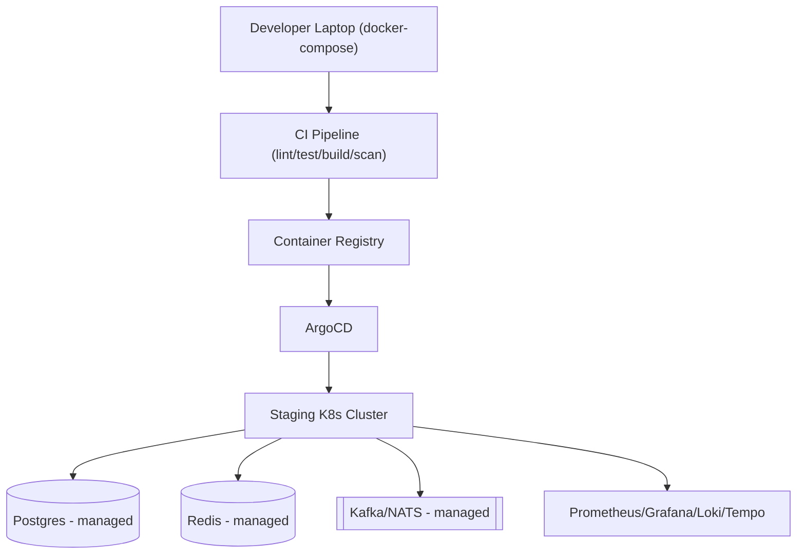

# Mesera — Phase 0: Foundations

**Duration:** 6 weeks
**Depends on:** Nothing (project kickoff)
**Blocks:** All subsequent phases
**Primary owners:** Tech Lead, SRE/DevOps, Platform Team

---

## 1. Objective

Establish the engineering foundation that every later phase depends on: a working monorepo, CI/CD pipeline, provisioned infrastructure, observability stack, coding standards, and the key architecture decisions that are expensive to reverse later (event log choice, database topology, protocol direction). No product feature code is written in this phase — the output is a "paved road" that lets every following team move fast without re-deciding infrastructure basics.

## 2. Scope

### In scope
- Cargo workspace skeleton with empty-but-compiling service crates
- Terraform-provisioned Kubernetes cluster + managed data stores in a staging environment
- CI pipeline (lint/test/build/scan) running on every PR
- Base Docker images
- Prometheus/Grafana/Loki/Tempo observability stack
- Design token system (CSS variables) seeded from the product design spec
- Architecture Decision Records (ADRs) for the ten decisions listed in the master plan's Appendix 20.1
- Rust and JS coding standards documents, linters configured and enforced in CI
- Local dev loop via `docker-compose`

### Out of scope (explicitly deferred)
- Any real authentication logic (Phase 1)
- Any message handling logic (Phase 2)
- Any UI screens beyond a placeholder "Hello Mesera" page to prove the build pipeline

## 3. Phase Architecture Snapshot

## 4. Detailed Tasks

### P0-01 — Event Log Decision Spike (Kafka vs NATS JetStream)

**Description:** Build two minimal proof-of-concept producer/consumer harnesses in Rust — one against Kafka (`rdkafka`), one against NATS JetStream (`async-nats`) — and benchmark them on the criteria that matter for Mesera's update-fanout use case: per-partition ordering guarantees, consumer group rebalance latency, operational complexity (self-hosted vs managed availability), message replay semantics, and throughput under 3 brokers/nodes with `chat_id`-based partitioning.

**Subtasks:**
- Stand up both clusters locally via `docker-compose`
- Write a benchmark harness producing 10k messages/sec across 1,000 simulated `chat_id` partitions
- Measure p50/p99 publish latency, consumer lag under load, and rebalance time when a broker/node is killed
- Document operational tooling maturity (monitoring, CLI, managed-cloud availability) for each
- Write ADR-001 with the final recommendation and rationale

**Acceptance criteria:** ADR-001 merged, benchmark numbers published, decision unblocks P2-06 (Kafka producer implementation) in Phase 2.

**Estimated effort:** 5 engineer-days.

---

### P0-02 — Cargo Workspace Skeleton

**Description:** Create the full crate layout defined in the master plan §5.1, with each crate containing a minimal `lib.rs`/`main.rs` that compiles, a `Cargo.toml` with agreed-upon shared dependency versions pinned at the workspace root, and placeholder `tests/` directories wired into `cargo-nextest`.

**Subtasks:**
- Create workspace root `Cargo.toml` with `[workspace.dependencies]` pinning tokio, serde, tonic, axum, sqlx, tracing versions
- Scaffold all 15 crates listed in §5.1 of the master plan
- Add `common-telemetry` crate with a reusable `init_tracing()` helper so every service gets structured logging for free
- Add `common-db` crate with pooled connection setup for Postgres (sqlx) and a stub for Scylla
- Verify `cargo build --workspace` and `cargo nextest run --workspace` succeed in CI

**Acceptance criteria:** Fresh clone + `cargo build --workspace` succeeds with zero warnings under `clippy::pedantic` baseline ruleset.

**Estimated effort:** 4 engineer-days.

---

### P0-03 — Infrastructure Provisioning (Terraform)

**Description:** Write Terraform modules for a staging environment: VPC/networking, a Kubernetes cluster (EKS/GKE or self-managed via kubeadm depending on cloud decision), managed Postgres instance (or self-hosted via Helm if cost/control favors it), Redis cluster, and the chosen event log cluster from P0-01.

**Subtasks:**
- Module: `network` (VPC, subnets, security groups/firewall rules)
- Module: `k8s-cluster` (node pools sized for early-stage workloads, autoscaling group 3–10 nodes)
- Module: `postgres` (managed instance, automated backups, read replica)
- Module: `redis` (cluster mode, 3 shards × 2 replicas minimum)
- Module: `event-log` (per ADR-001 outcome)
- Module: `object-storage` (S3 bucket or MinIO Helm release with erasure coding)
- Wire Terraform state to a remote backend (S3 + DynamoDB lock table, or equivalent)
- Document `terraform plan`/`apply` runbook

**Acceptance criteria:** `terraform apply` from a clean state stands up a working staging environment in under 30 minutes; `terraform destroy` cleanly tears it down.

**Estimated effort:** 8 engineer-days.

---

### P0-04 — Base Docker Images

**Description:** Build minimal, reproducible container images: a Rust builder image (multi-stage, `cargo-chef` for dependency caching) producing distroless runtime images per service, and a Node/esbuild image for frontend asset builds.

**Subtasks:**
- Multi-stage `Dockerfile.rust-service` using `cargo-chef` to cache dependency compilation across builds
- Distroless final stage (`gcr.io/distroless/cc` or `scratch` + statically linked binary via `musl` target)
- `Dockerfile.frontend-build` for esbuild bundling, output served via a lightweight static file server or CDN origin
- Image size and CVE baseline scan (Trivy) wired into CI
- Publish images to the container registry with semantic version + git-sha tags

**Acceptance criteria:** Rust service images < 50MB, zero Critical CVEs at baseline, build reproducible (same input → same image digest modulo timestamps).

**Estimated effort:** 4 engineer-days.

---

### P0-05 — CI/CD Pipeline Bootstrap

**Description:** Configure the CI system (GitHub Actions or GitLab CI) to run on every PR: formatting check (`rustfmt --check`, `eslint`), static analysis (`clippy`), unit tests (`cargo nextest`, `web-test-runner`), dependency audit (`cargo-audit`, `cargo-deny`, `npm audit`), and image build. Configure ArgoCD for GitOps-style continuous deployment to staging on merge to `main`.

**Subtasks:**
- CI workflow: lint job (parallel Rust + JS)
- CI workflow: test job (matrix across crates, cached `~/.cargo` and `node_modules`)
- CI workflow: security scan job (fails build on Critical/High CVE)
- CI workflow: build-and-push job (only on merge to `main`, tags image with git-sha)
- ArgoCD `Application` manifests pointing at Helm charts per service, auto-sync enabled for staging, manual sync gate for production (used starting Phase 8)
- Branch protection rules requiring green CI + 2 approvals before merge

**Acceptance criteria:** A trivial PR (e.g., README typo fix) goes green end-to-end in under 10 minutes; a merge to `main` auto-deploys to staging within 5 minutes of image publish.

**Estimated effort:** 6 engineer-days.

---

### P0-06 — Observability Stack

**Description:** Deploy Prometheus, Grafana, Loki, and Tempo via Helm into the staging cluster; wire the `common-telemetry` crate so every future service automatically exports metrics, structured logs, and traces with zero per-service boilerplate.

**Subtasks:**
- Helm-install kube-prometheus-stack (Prometheus + Alertmanager + Grafana)
- Helm-install Loki + Promtail (or Grafana Agent) for log aggregation
- Helm-install Tempo + configure OpenTelemetry Collector for trace ingestion
- Build starter Grafana dashboards: per-service RED metrics, node resource usage, pod restart counts
- Verify a `common-telemetry::init_tracing()` call in a placeholder service produces visible metrics/logs/traces within 60 seconds

**Acceptance criteria:** Dashboards accessible via internal URL; a test service emits a custom counter metric and it appears in Grafana without manual wiring.

**Estimated effort:** 5 engineer-days.

---

### P0-07 — Design Token System

**Description:** Working with the product designer, extract the Telegram-parity visual language (colors, type scale, spacing grid, radii, motion curves) from the Figma spec into the `tokens.css` file described in the master plan §9.1, plus a documented process for keeping Figma and CSS tokens in sync.

**Subtasks:**
- Audit Figma file for all color, spacing, and typography tokens
- Define `tokens.css` variable naming convention (`--mesera-{category}-{name}`)
- Produce light/dark/night-blue theme variable sets
- Write a short design-token contribution guide for future UI work
- Validate tokens render correctly in the placeholder "Hello Mesera" page across breakpoints

**Acceptance criteria:** `tokens.css` v1 merged; placeholder page correctly switches themes via `data-theme` attribute.

**Estimated effort:** 4 designer-days + 2 engineer-days.

---

### P0-08 — Architecture Decision Records

**Description:** Author the ten ADRs listed in the master plan's Appendix 20.1, each following a standard ADR template (Context, Decision, Consequences, Alternatives Considered). These are living documents reviewed and signed off by the Tech Lead and relevant workstream leads before Phase 1 begins.

**Subtasks:**
- ADR-001: Event log choice (output of P0-01)
- ADR-002: Message store (ScyllaDB vs Cassandra vs sharded Postgres) — desk research + informal benchmark
- ADR-003: MTP-lite vs adopting gRPC-Web — prototype comparison of framing overhead and browser compatibility
- ADR-004: Frontend framework decision (vanilla JS + Web Components, confirming project constraint) — document trade-offs for the record
- ADR-006: Auth token strategy (JWT vs opaque tokens) — informs Phase 1 design
- ADR-007: Postgres sharding strategy — informs when sharding is triggered (deferred until scale requires it, documented threshold)
- ADR-008: Push provider abstraction design
- ADR-009: Search engine choice (OpenSearch vs Meilisearch)
- ADR-010: Secrets management (Vault topology, single cluster vs per-environment)
- ADR-005 (SFU build-vs-adopt) is intentionally deferred to Phase 6 since it depends on nothing from Phase 0; noted here as "not yet due."

**Acceptance criteria:** 9 of 10 ADRs (excluding ADR-005) merged and reviewed before Phase 1 kickoff meeting.

**Estimated effort:** 6 engineer-days (spread across contributors), 2 days Tech Lead review time.

---

## 5. Phase 0 Task Summary Table

| Task ID | Task | Est. Effort | Owner |
|---|---|---|---|
| P0-01 | Event log decision spike | 5d | Realtime/Infra |
| P0-02 | Cargo workspace skeleton | 4d | Backend |
| P0-03 | Infra provisioning (Terraform) | 8d | SRE/DevOps |
| P0-04 | Base Docker images | 4d | SRE/DevOps |
| P0-05 | CI/CD pipeline bootstrap | 6d | SRE/DevOps |
| P0-06 | Observability stack | 5d | SRE/DevOps |
| P0-07 | Design token system | 4d designer + 2d eng | Design + Frontend |
| P0-08 | Architecture Decision Records | 6d (distributed) | Tech Lead + leads |

## 6. Exit Criteria (Definition of Done for Phase 0)

- [ ] `cargo build --workspace` succeeds on a clean clone with zero warnings
- [ ] `terraform apply` stands up a full staging environment unattended
- [ ] CI pipeline green on `main`, enforced on all PRs via branch protection
- [ ] Grafana dashboards show live metrics from at least one deployed placeholder service
- [ ] `tokens.css` v1 merged and validated across breakpoints
- [ ] 9/10 ADRs merged and reviewed
- [ ] Rust and JS coding standards documents published and linters enforce them in CI

## 7. Phase-Specific Risks

| Risk | Mitigation |
|---|---|
| Event log spike takes longer than budgeted, delaying Phase 1 kickoff | Timebox to 5 days; if inconclusive, default to Kafka (higher ecosystem maturity) and revisit later |
| Terraform module complexity underestimated for multi-service topology | Start with a minimal single-region module set; expand for multi-region only after Phase 8 needs it |
| Design tokens change significantly once real UI work begins in Phase 3 | Treat `tokens.css` v1 as a living document with a lightweight change process, not a frozen spec |
