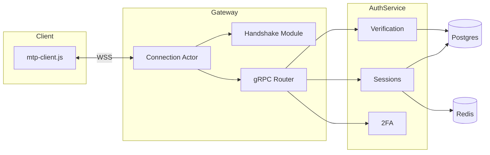

# Mesera — Phase 1: Identity & Transport

**Duration:** 5 weeks
**Depends on:** Phase 0 (workspace, CI/CD, infra, ADR-001/003/006 decisions)
**Blocks:** Phase 2 (Core Messaging), Phase 3 (Web Client MVP)
**Primary owners:** Realtime/Infra Team, Backend Team, Frontend Team

---

## 1. Objective

Deliver the two things every other feature in Mesera sits on top of: a working realtime transport (MTP-lite protocol + WS gateway) and a working identity system (phone/email verification, sessions, devices, 2FA). At the end of this phase, a client can open the web app, log in, and hold a persistent authenticated WebSocket connection to the gateway — with nothing to actually send yet, since chats/messages arrive in Phase 2.

## 2. Scope

### In scope
- MTP-lite binary schema definition and versioning strategy
- Frame codec (encode/decode) with property-based round-trip tests
- X25519 handshake + AES-256-GCM session encryption
- WS gateway connection actor model
- gRPC routing from gateway to internal services
- Auth service: phone/email verification, session/device registration, 2FA
- Frontend `mtp-client.js` and auth screens
- End-to-end integration test of the login flow

### Out of scope
- Chat/message data model (Phase 2)
- Any UI beyond auth screens (Phase 3)
- Media, calls, bots (later phases)

## 3. Phase Architecture Snapshot

## 4. Detailed Tasks

### P1-01 — MTP-lite Binary Schema Design

**Description:** Define the full application-layer message schema (analogous to a TL-schema): every RPC request/response type and every server-pushed update type gets a stable numeric type ID, a Protobuf-defined payload, and an explicit versioning rule so new fields can be added without breaking older clients.

**Subtasks:**
- Enumerate all RPC methods needed through Phase 7 (even if implemented later) so the ID space is reserved up front — see master plan §7.3 for the initial method list
- Define the frame header layout from §7.2 (magic, length, msg_id, seq_no, flags, payload, auth_tag) as a Rust struct with `serde`/manual bit-packing
- Define a schema versioning policy: new optional fields are additive-only within a major version; breaking changes bump `magic`
- Write the schema spec as a markdown reference doc checked into `mtp-protocol/SCHEMA.md`

**Acceptance criteria:** Schema doc reviewed and signed off by Backend + Frontend + Realtime leads; every Phase 2–7 RPC method has a reserved type ID.

**Estimated effort:** 4 engineer-days.

---

### P1-02 — Frame Codec Implementation

**Description:** Implement the binary encoder/decoder for MTP-lite frames in the `mtp-protocol` crate: varint encoding for length-prefixing, zero-copy deserialization where feasible (`bytes::Bytes`), and defensive parsing (reject malformed/oversized frames before allocating).

**Subtasks:**
- Implement `Frame::encode(&self) -> BytesMut` and `Frame::decode(&mut Bytes) -> Result<Frame, CodecError>`
- Property-based tests (`proptest`) asserting `decode(encode(f)) == f` for arbitrary valid frames
- Fuzz testing (`cargo-fuzz`) on `decode` to catch panics/OOB on malformed input
- Benchmark encode/decode throughput (`criterion`) to confirm it's not a bottleneck vs JSON
- Implement optional payload compression (e.g., zstd) behind a flag bit for large payloads

**Acceptance criteria:** Zero panics after 1M fuzz iterations; benchmark shows codec overhead < 5% of total frame processing time.

**Estimated effort:** 6 engineer-days.

---

### P1-03 — Handshake & Session Encryption

**Description:** Implement the connection-establishment crypto handshake: client and server perform an ephemeral X25519 key exchange, derive a shared session key via HKDF-SHA256, and use AES-256-GCM to encrypt/authenticate every frame thereafter, as described in master plan §7.1.

**Subtasks:**
- Implement `crypto::Handshake` state machine (client and server sides) using `x25519-dalek`
- Implement HKDF key derivation (`hkdf` crate) with domain-separation info strings
- Implement AES-256-GCM encrypt/decrypt wrapper (`aes-gcm` crate) with nonce management (counter-based, never reused per key)
- Write known-answer test vectors to guard against silent crypto regressions
- Document the handshake in a sequence diagram in `mtp-protocol/SCHEMA.md`
- Security self-review checklist: no key reuse, no nonce reuse, constant-time comparison for auth tags

**Acceptance criteria:** Handshake completes in a single round trip; test vectors pass; internal security review sign-off (full external review happens in Phase 7, but a lightweight internal check is required here since this is foundational).

**Estimated effort:** 7 engineer-days.

---

### P1-04 — WS Gateway Connection Actor Model

**Description:** Build the gateway's per-connection Tokio task ("connection actor") and per-user "session hub" task as described in master plan §5.5, using `mpsc` channels for communication and a `DashMap`-based connection registry for cross-task lookups (e.g., routing an update to a specific online device).

**Subtasks:**
- Implement `ConnectionActor` task: owns the WS socket, runs the handshake, then loops reading/writing frames
- Implement `SessionHub` task: one per logged-in user, fans updates out to all of that user's connected device actors
- Implement `ConnectionRegistry` (`DashMap<UserId, SessionHubHandle>`) for the gateway node
- Implement graceful shutdown (drain connections on pod termination, SIGTERM handling)
- Implement backpressure handling (bounded channels, slow-client detection and disconnect policy)
- Load test: 10,000 concurrent connections on a single gateway pod, verify CPU/memory stay within the budget in master plan §18.2

**Acceptance criteria:** Single gateway pod sustains 10k idle connections within CPU/memory budget; graceful shutdown drains without dropping in-flight frames.

**Estimated effort:** 8 engineer-days.

---

### P1-05 — gRPC Router (Gateway → Services)

**Description:** Implement the internal routing layer that takes a decoded MTP-lite RPC request and dispatches it to the correct backend service over gRPC (`tonic`), with deadlines, retries, and circuit-breaking via `tower` middleware.

**Subtasks:**
- Define `.proto` contracts for Auth service RPCs (this phase) with room to add more services' `.proto` files in later phases without router changes
- Implement `Router::dispatch(rpc_type, payload, auth_ctx) -> Result<Response>` with a match/dispatch table keyed by RPC type ID
- Wire `tower` middleware stack: timeout, retry with exponential backoff + jitter, circuit breaker (open after N consecutive failures)
- Implement mTLS between gateway and services using certs issued via the Vault PKI backend (or a simpler internal CA for staging)
- Integration test: simulate a downstream service outage, verify circuit breaker opens and gateway returns a clean error to the client instead of hanging

**Acceptance criteria:** Router correctly dispatches to a stub Auth service; circuit breaker verified via chaos test (kill Auth service pod mid-request).

**Estimated effort:** 6 engineer-days.

---

### P1-06 — Auth Service: Verification Flow

**Description:** Implement phone number and email verification: request a one-time code, deliver it via an SMS/email provider abstraction (so the underlying provider — Twilio, SendGrid, etc. — can be swapped without touching business logic), and validate the code with TTL and attempt-limiting.

**Subtasks:**
- Define `SmsProvider` and `EmailProvider` traits with a `send_code(destination, code)` method; implement one concrete adapter each (e.g., Twilio, SendGrid) plus a `FakeProvider` for tests/staging
- Implement `auth.sendCode` RPC: generate a cryptographically random 5–6 digit code, store in Redis (`otp:{phone_number}`) with 5-minute TTL, rate-limit requests per phone number/IP
- Implement `auth.signIn` RPC: verify code, create/find user record, issue session
- Implement anti-abuse guardrails: max 3 code requests per phone per hour, max 5 verification attempts per code
- Unit + integration tests covering happy path, expired code, wrong code, rate-limit exceeded

**Acceptance criteria:** A test client can request a code (delivered via `FakeProvider` in test/staging) and sign in with it; abuse guardrails verified by tests.

**Estimated effort:** 6 engineer-days.

---

### P1-07 — Auth Service: Sessions & Devices

**Description:** Implement session and device registration: upon successful verification, issue a session bound to a specific device (platform, push token placeholder, public key for future E2E use), and implement the session token format decided in ADR-006.

**Subtasks:**
- Implement `devices` and `sessions` Postgres tables per master plan §6.2 ERD
- Implement token issuance (JWT or opaque, per ADR-006) with access token (short TTL) + refresh token (long TTL) pair
- Implement `sessions.list` and `sessions.revoke` RPCs (view/terminate active sessions — a Telegram-parity feature)
- Implement `common-auth` middleware: verifies incoming tokens on every subsequent gRPC call across all services, injects `AuthContext` (user_id, device_id, session_id) into request extensions
- Cache session lookups in Redis to avoid a Postgres round-trip on every authenticated request

**Acceptance criteria:** A client can log in, receive tokens, make an authenticated call, list its own sessions, and revoke a different session (simulating "log out other device").

**Estimated effort:** 6 engineer-days.

---

### P1-08 — Auth Service: Two-Factor Authentication

**Description:** Implement optional TOTP-based 2FA with a recovery-email fallback, matching Telegram's two-step verification model.

**Subtasks:**
- Implement `auth.enable2FA` (generates and returns a TOTP secret + QR-code payload), `auth.verify2FA`, `auth.disable2FA`
- Store TOTP secret encrypted at rest (KMS-wrapped, per master plan §10.4 pattern, introduced early here)
- Implement recovery-email flow: if TOTP is lost, a time-delayed recovery process (mirroring Telegram's "wait N days" account-recovery security trade-off) sends a reset link
- Extend `auth.signIn` to require a second factor when 2FA is enabled on the account
- Unit tests for TOTP generation/validation against RFC 6238 test vectors

**Acceptance criteria:** Enabling 2FA and signing in with a valid TOTP code (or being correctly rejected with an invalid one) works end-to-end.

**Estimated effort:** 5 engineer-days.

---

### P1-09 — Frontend: `mtp-client.js`

**Description:** Implement the browser-side WebSocket client: opens the connection, performs the X25519/AES-GCM handshake using the Web Crypto API, encodes/decodes MTP-lite frames, and exposes a small promise-based RPC interface (`client.call('auth.sendCode', payload)`) plus an event-emitter interface for server-pushed updates.

**Subtasks:**
- Implement `mtp-client.js`: connection lifecycle (connect/reconnect with exponential backoff), handshake using `crypto.subtle` APIs
- Implement binary frame encode/decode mirroring the Rust codec exactly (shared schema doc as source of truth)
- Implement request/response correlation via `msg_id` (pending-promise map)
- Implement update event dispatch (subscribe/unsubscribe pattern) for §7.5-style pushed updates
- Unit tests (`web-test-runner`) for codec round-trip and handshake logic against a mock server

**Acceptance criteria:** `mtp-client.js` successfully completes a handshake and RPC round-trip against a local gateway instance; reconnect-with-backoff verified by killing/restarting the local gateway mid-session.

**Estimated effort:** 7 engineer-days.

---

### P1-10 — Frontend: Auth Screens

**Description:** Build the phone-entry and code-entry UI screens described in master plan §9.4, wired to `mtp-client.js`, using the design tokens from Phase 0.

**Subtasks:**
- `<mesera-auth-phone>` component: country-code selector, phone input, validation, loading state
- `<mesera-auth-code>` component: code input, resend countdown timer, error state
- `<mesera-auth-profile-setup>` component: first/last name + avatar upload placeholder (real upload wired in Phase 4)
- Wire components to `auth.sendCode`/`auth.signIn` via `mtp-client.js`
- Persist session tokens securely (in-memory + IndexedDB, never `localStorage` per security best practice, since `localStorage` is script-accessible and more XSS-exposed)
- Responsive layout verified at all four breakpoints from §8.5

**Acceptance criteria:** A user can complete the full phone → code → profile-setup flow in the browser against the real (staging) Auth service.

**Estimated effort:** 6 engineer-days.

---

### P1-11 — Integration Test: End-to-End Login

**Description:** Automated integration test exercising the complete path: browser (via Playwright) → gateway → auth-service → Postgres/Redis, confirming the whole stack works together, not just each piece in isolation.

**Subtasks:**
- Playwright script: enter phone number, receive code via `FakeProvider` (exposed through a test-only debug endpoint in staging), enter code, land on profile setup
- Assert session cookie/token persisted and a subsequent page reload stays logged in (via `updates.getDifference`-style session restore, even though there's no chat data yet)
- Wire this test into the CI pipeline as a required check before merge to `main`
- Add a synthetic monitoring version of this same script (k6 or a lightweight scheduled Playwright run) hitting staging every 15 minutes

**Acceptance criteria:** Test passes reliably (< 1% flake rate over 50 CI runs) and is required for merge.

**Estimated effort:** 4 engineer-days.

---

## 5. Phase 1 Task Summary Table

| Task ID | Task | Est. Effort | Owner |
|---|---|---|---|
| P1-01 | MTP-lite schema design | 4d | Realtime/Infra |
| P1-02 | Frame codec implementation | 6d | Realtime/Infra |
| P1-03 | Handshake & session encryption | 7d | Realtime/Infra + Security |
| P1-04 | Gateway connection actor model | 8d | Realtime/Infra |
| P1-05 | gRPC router | 6d | Backend |
| P1-06 | Auth: verification flow | 6d | Backend |
| P1-07 | Auth: sessions & devices | 6d | Backend |
| P1-08 | Auth: 2FA | 5d | Backend |
| P1-09 | Frontend: mtp-client.js | 7d | Frontend |
| P1-10 | Frontend: auth screens | 6d | Frontend |
| P1-11 | E2E login integration test | 4d | QA |

**Total:** ~65 engineer-days across parallel workstreams (~5 weeks with a team of ~6 engineers working concurrently on transport vs auth vs frontend tracks).

## 6. Exit Criteria (Definition of Done for Phase 1)

- [ ] Client can connect, complete handshake, and hold a persistent encrypted WS session
- [ ] Full login flow (phone/email → code → session) works end-to-end in staging
- [ ] 2FA can be enabled and enforced on login
- [ ] Session listing and remote revocation work
- [ ] `mtp-client.js` reconnects gracefully after network interruption
- [ ] Gateway sustains 10k connections/pod within resource budget
- [ ] E2E login test is a required, stable CI check

## 7. Phase-Specific Risks

| Risk | Mitigation |
|---|---|
| Handshake crypto implemented incorrectly (subtle bugs are common in hand-rolled protocol crypto) | Use only vetted primitive crates, add known-answer test vectors, schedule a focused internal crypto review before sign-off; full external audit still happens in Phase 7 |
| Connection actor model has concurrency bugs (deadlocks, channel backpressure stalls) | Extensive `loom`-based concurrency testing on the actor message-passing logic in addition to normal integration tests |
| SMS/email provider costs or deliverability issues discovered late | Integrate a real provider (not just `FakeProvider`) in staging early in the phase, not at the end |
| Frontend/backend codec drift (schema doc and implementations diverge) | Treat `SCHEMA.md` as the single source of truth; add a CI check that fails if Rust and JS codec test vectors disagree |
