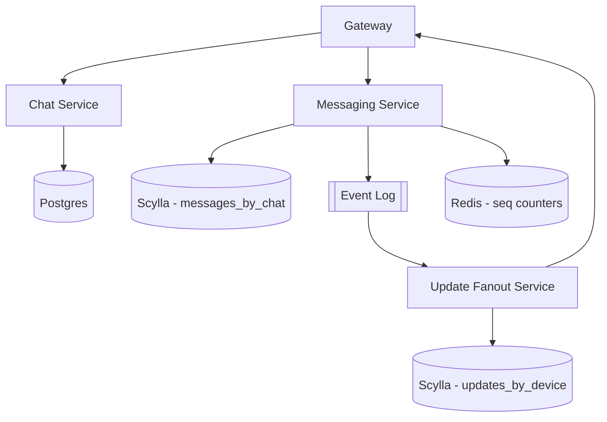

# Mesera — Phase 2: Core Messaging

**Duration:** 8 weeks
**Depends on:** Phase 1 (transport + auth working)
**Blocks:** Phase 3 (UI needs data to render), Phase 4, Phase 5
**Primary owners:** Messaging Team, Realtime Team

---

## 1. Objective

Build the actual messaging engine: chats, membership, message send/edit/delete, and the update-fanout system that delivers messages to every online device in real time and lets offline devices catch up correctly on reconnect. This is the largest and highest-risk backend phase — correctness of message ordering and delivery guarantees here determines the reliability of the entire product.

## 2. Scope

### In scope
- Postgres schema for chats/members/permissions
- Scylla schema for message storage, validated under load
- Messaging service: send/edit/delete/reactions
- Per-chat monotonic message ID assignment
- Kafka/NATS event production on message lifecycle events
- Update fanout service and per-device sequencing
- `updates.getDifference` offline catch-up
- Read receipts
- Load testing to validate the data model at scale

### Out of scope
- Media attachments beyond a `media_ref` placeholder field (Phase 4 implements actual upload/storage)
- Group permission nuance beyond basic member/admin/owner roles (Phase 5 adds granular permissions)
- Any UI (Phase 3, built in parallel against this phase's APIs)

## 3. Phase Architecture Snapshot

## 4. Detailed Tasks

### P2-01 — Postgres Schema: Chats & Members

**Description:** Implement the `chats`, `chat_members`, `contacts`, and `blocked_users` tables from master plan §6.2, with migrations, indexes tuned for the access patterns Chat Service will need (lookup by user's chat list, lookup by chat's member list).

**Subtasks:**
- Write `sqlx` migration files for all four tables plus supporting indexes (`chat_members(user_id)`, `chat_members(chat_id)`, composite index for role-filtered member queries)
- Define `ChatType` enum (private/group/supergroup/channel) and `MemberRole` enum at the DB level
- Seed a small fixture dataset for local dev/testing
- Write repository-layer functions (`ChatRepo::create`, `ChatRepo::add_member`, `ChatRepo::list_for_user`, etc.) with `sqlx::query!` compile-time checked queries

**Acceptance criteria:** Migrations apply cleanly on a fresh DB; repository unit tests pass against a real Postgres test container (`testcontainers`).

**Estimated effort:** 5 engineer-days.

---

### P2-02 — Chat Service Implementation

**Description:** Implement the `chat-service` gRPC API: create chat/group, add/remove members, list a user's dialogs (chat list) with pagination, and basic role checks (owner/admin/member).

**Subtasks:**
- Implement `chats.create` (handles both 1:1 chat creation and group creation in one code path with a type discriminator)
- Implement `chats.addMember` / `chats.removeMember` with basic permission checks (only owner/admin can add/remove in groups)
- Implement `chats.getDialogs` with cursor-based pagination (not offset-based, to stay stable as new chats arrive)
- Implement `chats.getMembers` with pagination for large groups
- Contract tests verifying the gRPC API matches the `.proto` definitions exactly (catches accidental breaking changes)

**Acceptance criteria:** A test client can create a group, add three members, and retrieve the dialog list and member list correctly with pagination.

**Estimated effort:** 8 engineer-days.

---

### P2-03 — Scylla Schema Design & Load Validation

**Description:** This is the highest-risk task in the phase (flagged as Risk R2 in the master plan). Implement the `messages_by_chat` and related tables from master plan §6.3, then load-test the partitioning strategy specifically against the worst case: a 200,000-member channel receiving a high message rate, to confirm wide-partition reads stay performant.

**Subtasks:**
- Implement CQL schema for `messages_by_chat`, `messages_by_id`, `message_edits`, `reactions_by_message`, `read_state_by_chat_user`
- Build a synthetic load generator that simulates a large channel: X messages/sec written, concurrent paginated reads from many simulated readers
- Measure read/write p99 latency as partition size grows into the millions of rows; identify the point where wide-partition degradation becomes a problem
- If degradation is found at realistic scale, design and implement a bucketing strategy (e.g., partition key `(chat_id, time_bucket)` instead of just `chat_id`) and re-test
- Document the final schema and its scaling characteristics in a short design note

**Acceptance criteria:** Read/write p99 latency stays within SLO (master plan §18) for a simulated 200k-member channel at realistic message rates; design note reviewed and merged.

**Estimated effort:** 10 engineer-days (includes iteration if the first design doesn't hold up).

---

### P2-04 — Messaging Service: Send / Edit / Delete / Reactions

**Description:** Implement the core message lifecycle RPCs in `messaging-service`, including permission checks (can this user post in this chat given their role and the chat's settings), idempotent send (dedup by client-generated `random_id` so retried sends don't create duplicates), and soft-delete semantics.

**Subtasks:**
- Implement `messages.send`: validate sender is a chat member with post permission, assign `message_id` (see P2-05), write to Scylla, dedup on `random_id` within a short TTL window
- Implement `messages.edit`: only original sender (or admin, per chat settings) may edit; write to `message_edits` history table; enforce a configurable edit time window
- Implement `messages.delete`: soft-delete flag set, not physically removed immediately (supports "delete for everyone" semantics and audit needs); background job later purges old soft-deleted rows
- Implement `messages.react` / `messages.unreact`: write to `reactions_by_message`, aggregate counts returned to clients
- Implement `messages.getHistory`: cursor-paginated history fetch, newest-first, with reply/forward metadata resolved via `messages_by_id`

**Acceptance criteria:** Full CRUD + reactions verified via integration tests; duplicate sends (simulated network retry) produce exactly one message.

**Estimated effort:** 10 engineer-days.

---

### P2-05 — Monotonic Message ID Assignment

**Description:** Implement a correctness-critical piece: assigning strictly increasing `message_id` values per chat, safe under concurrent writers, with no gaps required but no duplicates ever allowed.

**Subtasks:**
- Implement Redis-based atomic counter (`INCR seq:{chat_id}`) as the primary mechanism — fast, simple, sufficient given Redis is already in the critical path for sessions
- Implement a fallback/reconciliation path using Scylla lightweight transactions (`INSERT ... IF NOT EXISTS`) in case Redis data is lost (counter must never regress) — on gateway/service restart, reconcile the Redis counter against `MAX(message_id)` observed in Scylla for that chat if the Redis value looks stale/missing
- Concurrency test: N parallel senders posting to the same chat simultaneously, assert the resulting `message_id` set has no duplicates and is contiguous or explainably sparse
- Chaos test: kill Redis mid-test, verify reconciliation logic prevents ID collisions after Redis comes back

**Acceptance criteria:** Zero collisions across 100 concurrent senders × 10,000 messages in a stress test; reconciliation verified after simulated Redis data loss.

**Estimated effort:** 6 engineer-days.

---

### P2-06 — Kafka/NATS Event Production

**Description:** Wire `messaging-service` to publish `MessageCreated`, `MessageEdited`, `MessageDeleted`, and `ReactionChanged` events onto the event log chosen in ADR-001, partitioned by `chat_id` to preserve ordering per chat.

**Subtasks:**
- Define Protobuf event schemas (versioned, with a schema registry or at minimum a checked-in `.proto` contract)
- Implement producer wrapper in `messaging-service` with at-least-once delivery guarantees (producer acks required, retry on transient failure)
- Ensure producer publish happens transactionally-adjacent to the Scylla write (outbox-pattern consideration: if the Scylla write succeeds but the Kafka publish fails, a background reconciliation job re-scans recent writes and republishes — documented as a follow-up hardening task if not done inline)
- Integration test: verify event ordering is preserved for a burst of messages in the same chat, and that partitioning correctly distributes across different chats

**Acceptance criteria:** Events observably arrive in-order per chat_id under a burst-load test; producer failure handling verified (simulated broker unavailability doesn't silently drop events).

**Estimated effort:** 6 engineer-days.

---

### P2-07 — Update Fanout Service

**Description:** Implement the consumer side: read events from the log, determine every device that needs to see this update (all members' online + offline devices), assign a per-device sequence number, persist to `updates_by_device` for offline catch-up, and push live to any currently-connected gateway sessions.

**Subtasks:**
- Implement Kafka/NATS consumer group in `update-fanout-service` with idempotent processing (dedupe on event ID in case of at-least-once redelivery)
- Implement per-device sequence assignment (`seq:{device_id}` counter, same pattern as P2-05)
- Implement `updates_by_device` writes with a bounded TTL/retention (old updates eventually expire; very-long-offline devices fall back to a full resync rather than replaying months of updates)
- Implement live push: look up currently-connected gateway sessions for each target device (via the connection registry / a lightweight service discovery mechanism) and push the update immediately; for offline devices, route to Push Service instead (stubbed interface in this phase, fully implemented in later phases)
- Load test: verify fanout latency stays low even for large groups (200k members) — this likely requires batching/streaming member iteration rather than loading the full member list into memory at once

**Acceptance criteria:** A message sent in a 3-member chat is delivered to the other two connected clients in under 150ms p95; fanout to a simulated 200k-member channel completes without unbounded memory growth.

**Estimated effort:** 9 engineer-days.

---

### P2-08 — `updates.getDifference` Catch-Up API

**Description:** Implement the reconnect/offline-catch-up flow from master plan §7.5: a client presents its last known `seq_no`, and the server returns everything it missed.

**Subtasks:**
- Implement `updates.getDifference(seq_no)` RPC reading from `updates_by_device` starting after the given sequence number
- Handle the "gap too large / TTL expired" case gracefully: if the requested `seq_no` is older than the retention window, respond with a "full resync required" signal instead of partial data, and the client falls back to re-fetching dialog list + recent history per chat
- Batch large differences (don't return 50,000 updates in one response; paginate with a continuation cursor)
- Integration test simulating a client going offline for varying durations (seconds, hours, past-retention) and verifying correct behavior in each case

**Acceptance criteria:** All three offline-duration scenarios (short gap, long gap within retention, gap beyond retention) behave correctly and are covered by automated tests.

**Estimated effort:** 6 engineer-days.

---

### P2-09 — Read Receipts

**Description:** Implement read-state tracking per chat member, and propagate read-state changes to other members so the UI can render the Telegram-style single/double-check indicators.

**Subtasks:**
- Implement `messages.markRead(chat_id, up_to_message_id)` updating `read_state_by_chat_user`
- Publish a `ReadStateChanged` event so other members' clients get a live update
- Implement unread-count calculation (used by chat list badges) — derived from `last_read_message_id` vs latest `message_id` in the chat
- Handle the group-chat nuance: "read by" needs per-member granularity for small groups but is typically aggregated/hidden for large groups (Telegram-parity behavior) — implement a member-count threshold for this UI-facing distinction

**Acceptance criteria:** Read state correctly propagates between two test clients; unread counts update correctly after marking read.

**Estimated effort:** 5 engineer-days.

---

### P2-10 — Load Test: Messaging Path

**Description:** End-of-phase validation load test exercising the full pipeline — send, Scylla write, Kafka publish, fanout, delivery — at the target concurrency and throughput from master plan §18.1 (scaled down proportionally to a realistic Phase 2 milestone target, e.g., 100k concurrent WS connections, 5k messages/sec sustained).

**Subtasks:**
- Build/extend the Rust WS load harness to simulate many concurrent authenticated clients sending and receiving messages across a realistic chat-size distribution (mostly 1:1 and small groups, a few large channels)
- Run a 4-hour soak test, monitoring for memory leaks, connection drops, and latency degradation over time
- Capture p50/p95/p99 latency for message delivery, categorized by chat size
- Produce a load test report with findings and any follow-up hardening tasks

**Acceptance criteria:** Sustained load for 4 hours with error rate < 0.1% and p95 delivery latency meeting the SLO in master plan §12.3.

**Estimated effort:** 6 engineer-days.

---

## 5. Phase 2 Task Summary Table

| Task ID | Task | Est. Effort | Owner |
|---|---|---|---|
| P2-01 | Postgres schema: chats & members | 5d | Backend |
| P2-02 | Chat service implementation | 8d | Backend |
| P2-03 | Scylla schema design & load validation | 10d | Backend + Realtime |
| P2-04 | Messaging service: send/edit/delete/reactions | 10d | Backend |
| P2-05 | Monotonic message ID assignment | 6d | Backend |
| P2-06 | Kafka/NATS event production | 6d | Realtime/Infra |
| P2-07 | Update fanout service | 9d | Realtime/Infra |
| P2-08 | `updates.getDifference` catch-up | 6d | Realtime/Infra |
| P2-09 | Read receipts | 5d | Backend |
| P2-10 | Load test: messaging path | 6d | QA + SRE |

**Total:** ~71 engineer-days across parallel tracks (~8 weeks with concurrent workstreams).

## 6. Exit Criteria (Definition of Done for Phase 2)

- [ ] Two authenticated clients can exchange messages in real time with correct ordering
- [ ] Message IDs are provably collision-free under concurrent load
- [ ] Offline clients correctly catch up via `getDifference` in all three gap-duration scenarios
- [ ] Read receipts propagate correctly
- [ ] Scylla schema validated at 200k-member channel scale
- [ ] 4-hour soak test passes at target load with error rate < 0.1%

## 7. Phase-Specific Risks

| Risk | Mitigation |
|---|---|
| Wide-partition degradation in Scylla at large channel scale (Risk R2 from master plan) | Dedicated load-validation task (P2-03) before building on top of the schema; bucketing fallback designed in advance |
| Message ID collisions under concurrent writers | Dedicated concurrency + chaos testing (P2-05) rather than assuming Redis atomicity is sufficient without verification |
| Event log becomes a throughput bottleneck under fanout for large channels | Batch/stream member iteration in fanout service instead of naive per-member loops; validated in P2-07 load test |
| Update retention window too short, causing frequent forced full-resyncs for real-world usage patterns | Tune retention based on P2-10 soak test data before Phase 3 UI work begins to rely on it |
