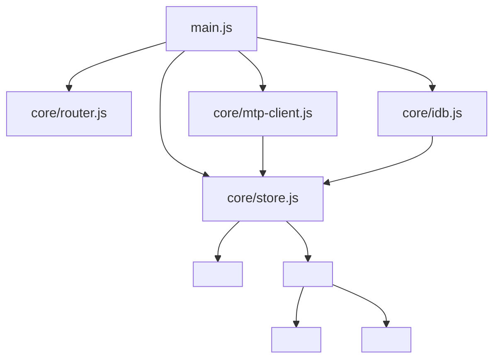

# Mesera — Phase 3: Web Client MVP

**Duration:** 8 weeks
**Depends on:** Phase 1 (transport/auth), Phase 2 (messaging APIs, developed largely in parallel — this phase can start against Phase 2's early API contracts before Phase 2 fully completes)
**Blocks:** Phase 4 UI work (media attach), Phase 7 UI work (secret chats), Phase 8 (visual/accessibility QA)
**Primary owners:** Frontend Team

---

## 1. Objective

Build the functional core of the vanilla-JS web client: the reactive state layer, routing, offline cache, and the primary chat UI (sidebar, chat window, composer) wired to real backend APIs, styled and responsive per the design tokens from Phase 0. By the end of this phase, a real user can log in, see their chat list, open a chat, and send/receive/edit/delete messages entirely through the UI.

## 2. Scope

### In scope
- Reactive store, router, IndexedDB cache (the "core" layer)
- Sidebar (chat list), chat window, message bubbles, composer
- Responsive breakpoint system
- Context menus, modals, bottom sheets
- Theming (light/dark/night-blue)
- Service Worker + PWA installability
- E2E test coverage for the core send/receive/edit/delete loop

### Out of scope
- Media attachment UI beyond a disabled/placeholder button (Phase 4)
- Group/channel admin UI (Phase 5)
- Call UI (Phase 6)
- Secret chat UI (Phase 7)

## 3. Phase Architecture Snapshot

## 4. Detailed Tasks

### P3-01 — Reactive Store

**Description:** Build the hand-rolled reactive state container described in master plan §8.3: a `Proxy`-wrapped state tree where mutations automatically notify subscribed components, avoiding the need for a virtual-DOM diffing framework.

**Subtasks:**
- Implement `createStore(initialState)` returning a `Proxy` with `get`/`set` traps that track subscribers per state path (e.g., `chats.byId.<id>.messages`)
- Implement `store.subscribe(path, callback)` / `store.unsubscribe`
- Implement batched notification (microtask-scheduled) so multiple synchronous mutations in one tick trigger a single re-render pass, not one per mutation
- Implement dev-mode debugging helpers (state snapshot logging, mutation history ring buffer) gated behind a `?debug=1` flag
- Unit tests covering nested path subscriptions, unsubscribe correctness, batching behavior

**Acceptance criteria:** A component subscribed to `chats.byId.123.messages` re-renders exactly once when three messages are pushed synchronously in the same tick; unsubscribed components never fire.

**Estimated effort:** 6 engineer-days.

---

### P3-02 — SPA Router

**Description:** Build a dependency-free client-side router using the History API, supporting deep-linkable chat URLs (`/chat/123`), back/forward navigation matching the mobile single-column navigation stack (list → chat → info), and route-based code-splitting hooks for future lazy-loaded features (calls, settings).

**Subtasks:**
- Implement `router.js`: route table registration, `pushState`/`popstate` handling, param extraction (`/chat/:id`)
- Implement the mobile navigation-stack behavior: on narrow viewports, navigating into a chat pushes a history entry so the hardware/browser back button returns to the list, matching native app conventions
- Implement route guards (redirect to `/auth` if not logged in)
- Unit + manual tests for back/forward behavior across the three main breakpoints

**Acceptance criteria:** Deep link to `/chat/123` opens directly into that chat after login; back button behaves correctly on mobile viewport (returns to list, not to a previous unrelated page).

**Estimated effort:** 5 engineer-days.

---

### P3-03 — IndexedDB Offline Cache

**Description:** Implement `idb.js`, a thin wrapper around IndexedDB for persisting dialogs, messages, and the last-known `seq_no`, enabling instant cold-start paint from cache before the network round-trip completes (per the offline-first flow in master plan §8.6).

**Subtasks:**
- Define object stores: `dialogs`, `messages` (indexed by `chat_id` + `message_id`), `meta` (last seq_no, user profile cache)
- Implement `idb.hydrate()` — bulk read on boot, feeding the reactive store before the WS connection even opens
- Implement `idb.persist(mutation)` — debounced writes so the UI thread isn't blocked on every single message
- Implement storage quota handling (graceful degradation if `StorageManager` reports low quota — evict oldest cached messages first)
- Test cold-start paint timing (should render cached chat list within ~100ms of script execution, well before network response)

**Acceptance criteria:** Reloading the app with an existing session shows the chat list within 100ms from cache, then reconciles with live data via `getDifference` without visible flicker.

**Estimated effort:** 6 engineer-days.

---

### P3-04 — `<mesera-sidebar>` (Chat List)

**Description:** Build the left-column chat list component: avatar, name, last message preview, timestamp, unread badge, muted/pinned indicators, and search-as-you-type filtering — the Telegram-parity chat list experience.

**Subtasks:**
- Implement virtualized list rendering (only render DOM nodes for visible rows + a small buffer) since large accounts may have thousands of dialogs — critical for scroll performance without a framework's built-in virtualization
- Implement live updates: new message reorders the chat to the top, updates preview text/unread badge without a full re-render of the list
- Implement pinned-chats section (always rendered above the regular list, per Telegram convention)
- Implement empty state (new account, no chats yet) and archived-folder affordance (folder itself is a Phase 5 feature; the UI hook is built here)
- Implement search-as-you-type filtering the visible list client-side (server-side global search comes in Phase 4)

**Acceptance criteria:** A list of 2,000 synthetic dialogs scrolls smoothly (60fps) via virtualization; a new incoming message correctly reorders and updates the relevant row without visible jank.

**Estimated effort:** 8 engineer-days.

---

### P3-05 — `<mesera-chat-window>` & `<mesera-message-bubble>`

**Description:** Build the center message pane: paginated message history rendering, message grouping (consecutive same-sender messages collapse avatar/name per master plan §9.3), timestamps, read-receipt icons, and reply/forward indicators.

**Subtasks:**
- Implement reverse-infinite-scroll pagination (load older messages when scrolling up, load newer when catching up) against `messages.getHistory`
- Implement message grouping logic (5-minute same-sender window) and the corresponding bubble tail/avatar rendering rules
- Implement bubble states: sending (optimistic, greyed/clock icon), sent (single check), delivered/read (double check), failed (retry affordance)
- Implement the "unread messages" divider line on first chat open, positioned at the first unread message
- Implement scroll-to-bottom floating action button with unread count badge, appearing only when scrolled away from the bottom
- Implement optimistic UI: message appears immediately on send with a client-generated `random_id`, then reconciles with the server-assigned `message_id` when the ack arrives (per master plan §5.2 sequence)

**Acceptance criteria:** Sending a message shows it instantly (optimistic), then correctly reconciles; scrolling up smoothly loads older history; grouping/read-receipt rendering matches the interaction parity checklist in master plan §9.3.

**Estimated effort:** 10 engineer-days.

---

### P3-06 — `<mesera-composer>`

**Description:** Build the message input bar: text entry with Enter-to-send / Shift+Enter-newline on desktop, formatting shortcuts (bold/italic/code via Markdown-like syntax or a lightweight toolbar), draft persistence, and reply-preview state.

**Subtasks:**
- Implement `contenteditable`-based rich text input (chosen over `<textarea>` to support inline formatting rendering) with careful handling of paste sanitization (strip unsafe HTML, preserve plain text/line breaks)
- Implement Markdown-shortcut formatting (`**bold**`, `` `code` ``) converted to formatting entities matching the backend's `entities` schema (master plan §6.3)
- Implement draft auto-save (debounced, persisted to IndexedDB per chat, restored when reopening the chat) mirroring Telegram's per-chat draft behavior
- Implement reply-preview UI (shown above the composer when replying, dismissible)
- Implement mobile-specific behavior: on-screen keyboard doesn't cover the composer (viewport/`visualViewport` API handling), safe-area-inset padding for notched devices

**Acceptance criteria:** Formatting shortcuts produce correctly structured entities sent to the backend; drafts persist across a page reload; composer stays visible above the mobile keyboard.

**Estimated effort:** 8 engineer-days.

---

### P3-07 — Responsive Breakpoint System

**Description:** Implement the CSS + minimal JS layout controller enforcing the four breakpoints from master plan §8.5, including the single-column mobile navigation stack behavior (list-only → chat-only, no simultaneous two-pane view below 600px).

**Subtasks:**
- Implement `layout.css` using CSS Grid for the outer app shell, with `container queries` where beneficial for component-level responsiveness independent of full viewport width
- Implement a small `layout-controller.js` that toggles a `data-layout="xs|sm|md|lg"` attribute on the root element (via `ResizeObserver`, not just `window.resize`, for accuracy inside flexible containers)
- Verify every component built so far (sidebar, chat window, composer) adapts correctly at each breakpoint per the table in master plan §8.5
- Cross-browser/device testing pass (Chrome, Safari, Firefox, plus real iOS/Android device testing via BrowserStack or physical devices)

**Acceptance criteria:** Manual QA checklist passes at all four breakpoints on at least three real devices/browsers; no horizontal scroll or clipped content at any tested width from 320px to 2560px.

**Estimated effort:** 6 engineer-days.

---

### P3-08 — Context Menu, Modals, Bottom Sheets

**Description:** Build the reusable `<mesera-context-menu>` and `<mesera-modal>` components used throughout the app for message actions (copy/reply/forward/delete/pin/react), confirmation dialogs, and mobile bottom sheets.

**Subtasks:**
- Implement `<mesera-context-menu>`: right-click trigger on desktop, long-press trigger (with a `touchstart`/`touchend` timer, canceling on scroll to avoid accidental triggers) on touch devices
- Implement `<mesera-modal>`: centered dialog on desktop, slides up as a bottom sheet on mobile (same component, CSS-driven presentation difference per breakpoint)
- Implement focus-trapping and `Escape`-to-close for accessibility (ties into Phase 8 WCAG work, but basic keyboard accessibility is built now, not retrofitted later)
- Wire message-bubble long-press/right-click to open the context menu with copy/reply/forward/delete/pin/react actions from master plan §9.3

**Acceptance criteria:** Context menu opens correctly on both interaction models without accidental triggers during normal scrolling; modal correctly traps focus and closes on Escape/backdrop click.

**Estimated effort:** 6 engineer-days.

---

### P3-09 — Theming

**Description:** Implement the light/dark/night-blue theme switcher using the `data-theme` attribute pattern and the token sets defined in Phase 0, plus system-theme-preference detection (`prefers-color-scheme`).

**Subtasks:**
- Implement theme persistence (IndexedDB `meta` store) and instant application on boot before first paint (avoid flash-of-wrong-theme by reading the persisted preference synchronously in an inline `<script>` in `index.html`)
- Implement `prefers-color-scheme` auto-detection as the default for first-time users
- Implement the theme picker UI in a basic settings placeholder (full settings panel is fleshed out further in later phases, but the theme switcher itself is core to this phase)
- Verify all components render correctly in all three themes (audit for any hardcoded colors that bypass the token system)

**Acceptance criteria:** No flash-of-wrong-theme on load; all three themes render correctly across every component built in this phase.

**Estimated effort:** 4 engineer-days.

---

### P3-10 — Service Worker & PWA

**Description:** Implement the Service Worker for app-shell caching and offline capability, plus the Web App Manifest for installability, per master plan §4.2/§8.1.

**Subtasks:**
- Implement `sw.js`: cache-first strategy for the app shell (HTML/CSS/JS bundle), network-first with cache fallback for API calls where sensible
- Implement cache versioning/invalidation tied to build hash, so deploys correctly bust stale caches without requiring a hard refresh
- Implement `manifest.json` (icons, theme color, display: standalone, start_url)
- Implement Background Sync registration hook for queued-but-unsent messages sent while offline (full offline-compose support may be a stretch goal; at minimum, detect offline state and show a clear "will send when reconnected" affordance)
- Verify installability via Lighthouse PWA audit

**Acceptance criteria:** Lighthouse PWA score passes installability criteria; app shell loads instantly on repeat visits even with network throttled to offline in dev tools.

**Estimated effort:** 5 engineer-days.

---

### P3-11 — Playwright E2E Suite

**Description:** Build the automated end-to-end test suite covering the core send/receive/edit/delete loop through the real UI against a staging backend, becoming a required CI gate for this and all future frontend work.

**Subtasks:**
- Test: two browser contexts (simulating two users), user A sends a message, assert it appears for user B within a latency budget
- Test: edit a sent message, assert the edit propagates and shows an "edited" label
- Test: delete a message, assert it disappears for both participants
- Test: reload mid-session, assert chat list and message history restore correctly from cache + `getDifference`
- Test: responsive behavior — run the core flow at both a mobile and desktop viewport size in the same suite
- Wire into CI as a required check, running against the ephemeral CI stack from Phase 0

**Acceptance criteria:** Suite passes reliably (< 1% flake rate) and blocks merge on failure.

**Estimated effort:** 6 engineer-days.

---

## 5. Phase 3 Task Summary Table

| Task ID | Task | Est. Effort | Owner |
|---|---|---|---|
| P3-01 | Reactive store | 6d | Frontend |
| P3-02 | SPA router | 5d | Frontend |
| P3-03 | IndexedDB offline cache | 6d | Frontend |
| P3-04 | Sidebar (chat list) | 8d | Frontend |
| P3-05 | Chat window & message bubble | 10d | Frontend |
| P3-06 | Composer | 8d | Frontend |
| P3-07 | Responsive breakpoint system | 6d | Frontend |
| P3-08 | Context menu, modals, bottom sheets | 6d | Frontend |
| P3-09 | Theming | 4d | Frontend + Design |
| P3-10 | Service Worker & PWA | 5d | Frontend |
| P3-11 | Playwright E2E suite | 6d | QA + Frontend |

**Total:** ~70 engineer-days (~8 weeks with a team of ~4 frontend engineers working concurrently on core-layer vs component tracks).

## 6. Exit Criteria (Definition of Done for Phase 3)

- [ ] User can log in, see chat list, open a chat, send/receive/edit/delete messages entirely via UI
- [ ] App is responsive and manually verified at all four breakpoints on real devices
- [ ] Cold start renders from cache in < 100ms, reconciles with server without flicker
- [ ] All three themes render correctly with no flash-of-wrong-theme
- [ ] App passes Lighthouse PWA installability audit
- [ ] Playwright E2E suite is a required, stable CI gate

## 7. Phase-Specific Risks

| Risk | Mitigation |
|---|---|
| Vanilla-JS velocity slower than expected for complex components (chat window, composer) | Front-load the reactive store and reusable component patterns (P3-01, P3-08) early so later components reuse proven patterns instead of reinventing them |
| Virtualized list rendering has subtle scroll-jank or measurement bugs | Dedicated performance testing with synthetic large datasets (2,000+ dialogs) before considering P3-04 done |
| `contenteditable`-based composer has cross-browser inconsistencies (a notoriously finicky API) | Budget extra QA time specifically on Safari/iOS, which historically has the most `contenteditable` quirks; keep a plain-`<textarea>` fallback path feasible if needed |
| Optimistic UI reconciliation has edge cases (out-of-order acks, failed sends) | Explicit test cases for failure/retry/out-of-order scenarios in P3-11, not just the happy path |
