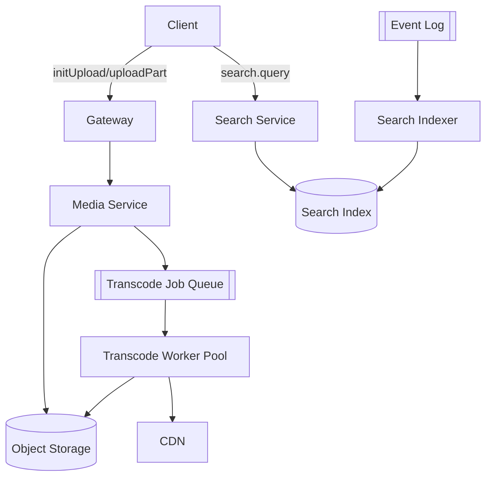

# Mesera — Phase 4: Media & Search

**Duration:** 7 weeks
**Depends on:** Phase 2 (messaging service exists to attach media to), Phase 3 (UI shell to build attach/viewer UI into)
**Blocks:** Phase 5 UI polish (stickers use the media pipeline), Phase 6 (calls reuse some transport patterns but are otherwise independent)
**Primary owners:** Media Team, Search Team, Frontend Team

---

## 1. Objective

Give Mesera the ability to send and receive rich media — photos, videos, voice messages, documents, stickers, GIFs — and to search across message history, contacts, and chats. This phase turns the text-only MVP from Phase 3 into a genuinely usable messenger.

## 2. Scope

### In scope
- Chunked/resumable upload API and S3-compatible storage integration
- Transcode worker pipeline (video/audio) and thumbnail/waveform generation
- CDN publishing and signed URL generation
- Frontend media attach flow, upload progress, drag-and-drop
- Frontend media viewer (photo/video/document lightbox)
- Search indexing pipeline and query API
- Frontend global search UI

### Out of scope
- Animated sticker (TGS) rendering engine polish (basic support only; refinement is a stretch task)
- Group call screen-share (Phase 6)

## 3. Phase Architecture Snapshot

## 4. Detailed Tasks

### P4-01 — Chunked/Resumable Upload API

**Description:** Implement `media-service`'s upload session lifecycle: `initUpload` establishes a session and chunk plan, `uploadPart` accepts individual chunks (allowing parallel/out-of-order upload and resume after connection loss), `finalizeUpload` completes and validates.

**Subtasks:**
- Implement upload session state tracking (Redis-backed, with part-completion bitmap) so a resumed upload knows exactly which parts are still missing
- Enforce per-file size limits and per-user concurrent-upload limits (abuse/cost control)
- Implement checksum validation per part (client sends a hash, server verifies) to catch corruption early rather than after full assembly
- Implement session expiry/cleanup for abandoned uploads (background job purges orphaned partial uploads from object storage)

**Acceptance criteria:** An upload interrupted mid-transfer (simulated connection drop) can be resumed from the client and completes correctly with matching checksums.

**Estimated effort:** 7 engineer-days.

---

### P4-02 — Object Storage Integration

**Description:** Wire `media-service` to S3-compatible multipart upload APIs (works against both MinIO self-hosted and AWS S3 without code changes, validated against both).

**Subtasks:**
- Implement `S3Client` wrapper (using `aws-sdk-s3` Rust crate, endpoint-configurable for MinIO compatibility)
- Implement multipart upload orchestration mapping Mesera's chunk model onto S3's multipart API (part numbers, ETags, `CompleteMultipartUpload`)
- Implement bucket lifecycle policies (e.g., auto-cleanup of incomplete multipart uploads after 24h at the storage layer as a second safety net beyond P4-01's application-level cleanup)
- Test against both MinIO (local/staging) and real AWS S3 (or equivalent) to confirm no provider-specific behavior leaked into the code

**Acceptance criteria:** Identical test suite passes against both MinIO and AWS S3 backends.

**Estimated effort:** 5 engineer-days.

---

### P4-03 — Transcode Worker Pipeline

**Description:** Build the background worker pool that processes uploaded video/audio into the variant matrix from master plan §11.2, using either `ffmpeg` invoked as a subprocess (pragmatic, mature, widely battle-tested) or Rust-native media crates where feasible for CPU-bound steps.

**Subtasks:**
- Implement job queue consumption (from the event log or a dedicated Redis/Kafka work queue) with worker autoscaling based on queue depth
- Implement video transcode step: H.264/AAC MP4 output at 360p and 720p renditions, plus original passthrough if under a size threshold
- Implement voice message transcode: Opus/OGG output, plus waveform peak extraction (downsampled amplitude array) for client-side waveform rendering
- Implement poster-frame extraction for video (first meaningful frame, not necessarily frame 0, to avoid black frames)
- Implement job failure handling: retries with backoff, dead-letter queue for permanently failing jobs, alerting on DLQ growth
- Benchmark transcode throughput/cost to inform worker pool sizing for the capacity model

**Acceptance criteria:** A 2-minute test video is transcoded into both renditions plus a poster frame within an SLA target (e.g., under 60 seconds for typical clip lengths); failure/retry path verified with an intentionally corrupt input file.

**Estimated effort:** 10 engineer-days.

---

### P4-04 — Thumbnail & Waveform Generation

**Description:** Implement photo thumbnailing (multiple sizes) and the voice-message waveform extraction referenced above, as a shared concern usable by both the photo and voice upload paths.

**Subtasks:**
- Implement photo resize pipeline (thumb/preview/full per master plan §11.2), EXIF metadata stripping for privacy, WebP output with JPEG fallback for broader compatibility
- Implement waveform peak extraction algorithm (decode audio, downsample amplitude envelope to ~100 data points, serialize as compact JSON/binary array)
- Unit tests comparing output dimensions/format against expected variant matrix for a range of input formats (JPEG, PNG, HEIC, WebP inputs)

**Acceptance criteria:** All variant outputs match the matrix in master plan §11.2 exactly for a representative test corpus of input files.

**Estimated effort:** 5 engineer-days.

---

### P4-05 — CDN Publish & Signed URLs

**Description:** Implement the final step of the media pipeline: publishing processed variants to the CDN origin and generating time-limited signed URLs so media stays access-controlled to chat members rather than being publicly guessable.

**Subtasks:**
- Configure CDN origin pointing at the object storage bucket (or a dedicated "public" bucket for already-processed variants)
- Implement signed URL generation (HMAC-signed, short expiry, regenerated on each `getHistory`/`getFile` response rather than stored long-term)
- Implement access-control check: signed URL generation itself requires the requesting user to be a member of the chat the media belongs to
- Load test CDN-fronted download throughput for typical media sizes

**Acceptance criteria:** A non-member of a chat cannot obtain a valid signed URL for that chat's media even with a guessed `file_id`; signed URLs correctly expire.

**Estimated effort:** 5 engineer-days.

---

### P4-06 — Frontend: Media Attach UI

**Description:** Build the client-side upload experience: attach button, drag-and-drop onto the chat window, upload progress indication, and multi-file selection.

**Subtasks:**
- Implement file picker + drag-and-drop zone over `<mesera-chat-window>`, with visual drop-target feedback
- Implement chunked upload client logic (mirrors P4-01's session model), including pause/resume on connection loss using the `mtp-client.js` reconnect hooks from Phase 1
- Implement per-file upload progress UI (progress bar within the composer/preview area) and cancel affordance
- Implement client-side image compression/resize before upload where appropriate (using `OffscreenCanvas` in a Web Worker to avoid blocking the main thread) to reduce upload size for large photos, matching Telegram's default "compress" send behavior, with an "send as file" (uncompressed) alternative

**Acceptance criteria:** Dragging three photos onto the chat window queues and uploads all three with visible per-file progress; cancel works mid-upload without leaving orphaned server-side state (relies on P4-01 session cleanup).

**Estimated effort:** 8 engineer-days.

---

### P4-07 — Frontend: Media Viewer

**Description:** Build the lightbox/viewer component for opening photos, videos, and documents at full size from within a chat.

**Subtasks:**
- Implement `<mesera-media-viewer>`: full-screen overlay, swipe/arrow navigation between consecutive media messages in the same chat, pinch-to-zoom on touch (using pointer events, not deprecated touch-specific APIs)
- Implement video playback controls (scrubber, play/pause, volume, fullscreen) built on the native `<video>` element with custom-styled controls matching the design tokens (native browser controls are hidden and replaced for visual parity)
- Implement document preview (PDF inline preview where feasible via `<embed>`/PDF.js consideration, or a download-with-icon fallback for unsupported types)
- Implement lazy-loading and `IntersectionObserver`-based decode deferral so off-screen media in a long chat history doesn't block scroll performance

**Acceptance criteria:** Opening a photo in a chat with many photos allows swiping through them; video playback controls function correctly and match the visual design; scroll performance in a media-heavy chat stays smooth.

**Estimated effort:** 8 engineer-days.

---

### P4-08 — Search Indexing Pipeline

**Description:** Implement `search-service`'s Kafka/NATS consumer that keeps the search index (OpenSearch or Meilisearch, per ADR-009) in near-real-time sync with message creation/edit/delete events.

**Subtasks:**
- Implement consumer subscribing to `MessageCreated`/`MessageEdited`/`MessageDeleted` events, projecting them into the search index's document schema
- Implement index mapping: message text (full-text analyzed), sender, chat_id, timestamp, with access-control metadata (chat membership) denormalized for query-time filtering
- Implement contact and chat-title indexing for the "search everywhere" experience (not just message text)
- Handle backfill: an initial bulk-index job for existing message history when the search service is first deployed (relevant given Phase 2 already produced data before this phase's indexer existed)

**Acceptance criteria:** A newly sent message becomes searchable within a few seconds; an edited message's old text is no longer matched and new text is; a deleted message disappears from results.

**Estimated effort:** 8 engineer-days.

---

### P4-09 — Search Query API

**Description:** Implement `search-service::query`, the read-side API that takes a user's search term and returns ranked, access-controlled results across messages, chats, and contacts.

**Subtasks:**
- Implement `search.query(term, scope)` RPC with scope filtering (this chat / all chats / contacts / global public chats)
- Implement access-control enforcement at query time (never return a message from a chat the requesting user isn't a member of, even if the index technically contains it — defense in depth alongside indexing-time metadata)
- Implement relevance ranking tuning (recency boost, exact-phrase boost) and pagination
- Write relevance test cases with a fixed fixture dataset and expected top-N results to catch ranking regressions

**Acceptance criteria:** Search results are correctly scoped, access-controlled, and relevance-ranked per the fixture test suite.

**Estimated effort:** 6 engineer-days.

---

### P4-10 — Frontend: Global Search UI

**Description:** Build the search overlay: a search bar that expands into a results view showing matched chats, messages (with highlighted matching text and jump-to-message), and contacts.

**Subtasks:**
- Implement `<mesera-search-overlay>`: triggered from the sidebar, debounced query-as-you-type against `search.query`
- Implement result grouping (Chats / Messages / Contacts sections) with highlighted match terms
- Implement "jump to message" — clicking a message result navigates into that chat and scrolls to/highlights the specific message (requires the chat window's pagination logic from Phase 3 to support jumping to an arbitrary `message_id`, not just sequential loading — this is a notable integration point worth flagging to the Phase 3 team in review)
- Responsive behavior: full-screen search on mobile, dropdown/panel on desktop

**Acceptance criteria:** Typing a query returns grouped, highlighted results within a responsive debounce window; clicking a message result correctly jumps to and highlights that message in context.

**Estimated effort:** 6 engineer-days.

---

## 5. Phase 4 Task Summary Table

| Task ID | Task | Est. Effort | Owner |
|---|---|---|---|
| P4-01 | Chunked/resumable upload API | 7d | Backend (Media) |
| P4-02 | Object storage integration | 5d | Backend (Media) |
| P4-03 | Transcode worker pipeline | 10d | Backend (Media) |
| P4-04 | Thumbnail & waveform generation | 5d | Backend (Media) |
| P4-05 | CDN publish & signed URLs | 5d | Backend (Media) + SRE |
| P4-06 | Frontend: media attach UI | 8d | Frontend |
| P4-07 | Frontend: media viewer | 8d | Frontend |
| P4-08 | Search indexing pipeline | 8d | Backend (Search) |
| P4-09 | Search query API | 6d | Backend (Search) |
| P4-10 | Frontend: global search UI | 6d | Frontend |

**Total:** ~68 engineer-days (~7 weeks with media and search sub-teams working in parallel).

## 6. Exit Criteria (Definition of Done for Phase 4)

- [ ] Photo, video, voice message, and document sending/receiving works end-to-end through the UI
- [ ] Upload resumes correctly after connection interruption
- [ ] All media variants match the matrix in master plan §11.2
- [ ] Media is access-controlled (no cross-chat leakage via guessed file IDs)
- [ ] Full-text search returns correct, access-controlled, ranked results within seconds of message send
- [ ] "Jump to message" from search results works correctly

## 7. Phase-Specific Risks

| Risk | Mitigation |
|---|---|
| Transcode pipeline cost/latency at scale (Risk R9 from master plan) | Benchmark early (P4-03), consider hardware-accelerated transcoding or tiered quality if costs are prohibitive |
| `ffmpeg` subprocess model introduces operational fragility (crashes, resource leaks) | Run workers in isolated, resource-limited containers with strict timeouts and automatic restart; never run untrusted input processing in the same process as other service logic |
| Search index falls behind under high message volume (indexing lag) | Monitor consumer lag as a first-class metric; scale indexer consumer group horizontally by partition |
| "Jump to arbitrary message" breaks assumptions in Phase 3's sequential-pagination chat window | Flag as a cross-phase integration point early; budget explicit collaboration time between Frontend and Search sub-teams rather than discovering the gap late |
