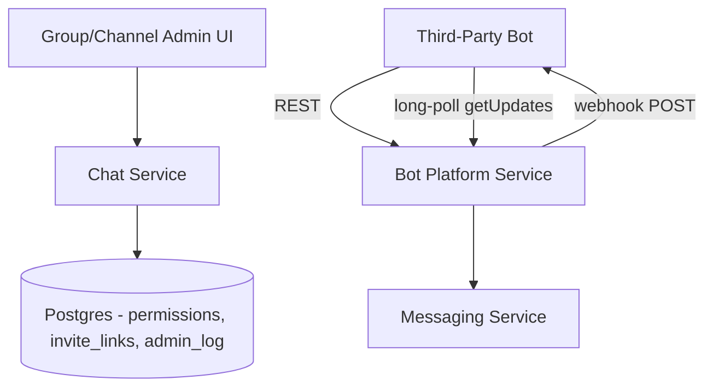

# Mesera — Phase 5: Groups, Channels & Bots

**Duration:** 7 weeks
**Depends on:** Phase 2 (chat/membership foundation), Phase 3 (UI shell)
**Blocks:** Nothing critical downstream, but informs Phase 8's full feature-parity QA pass
**Primary owners:** Backend (Chat/Platform) Team, Frontend Team

---

## 1. Objective

Extend the basic chat/group model from Phase 2 into Telegram's full spectrum of chat types and management capabilities: granular per-role permissions, invite links, admin audit logs, broadcast channels, and a third-party Bot Platform with a Telegram-Bot-API-compatible surface.

## 2. Scope

### In scope
- Granular permission model (per-role, per-action)
- Invite links (usage limits, expiry, revocation)
- Admin action audit log
- Channels (broadcast-only chat type, public usernames, subscriber model)
- Bot Platform: REST Bot API subset, webhook + long-poll delivery
- Reference bot suite for integration testing
- Frontend group/channel management UI

### Out of scope
- Bot payments/monetization APIs
- Channel post scheduling (nice-to-have, candidate for a post-launch iteration)

## 3. Phase Architecture Snapshot

## 4. Detailed Tasks

### P5-01 — Granular Permission Model

**Description:** Extend the basic owner/admin/member/restricted/banned roles from Phase 2 into Telegram's full per-permission granularity: separate toggles for send-messages, send-media, add-members, pin-messages, change-chat-info, delete-messages-from-others, and per-admin custom titles.

**Subtasks:**
- Extend `chat_members.permissions` JSONB column with a well-defined permission-flag schema (versioned, so new permission types can be added later without migration)
- Implement permission-check middleware shared across `chat-service` and `messaging-service` (a single source of truth function, `has_permission(user, chat, action)`, avoiding duplicated/drifting logic)
- Implement default-permission templates per chat type (e.g., channels default to admin-only posting; groups default to open posting)
- Implement custom admin titles (e.g., "Moderator" badge shown next to name) and comprehensive unit tests for every permission combination

**Acceptance criteria:** A matrix of permission-check unit tests (every role × every action) passes; permission changes take effect immediately for already-connected clients (via an update event, not requiring reconnect).

**Estimated effort:** 8 engineer-days.

---

### P5-02 — Invite Links

**Description:** Implement shareable invite links with configurable usage limits and expiry, matching Telegram's invite link management UX.

**Subtasks:**
- Implement `chats.createInviteLink(chat_id, usage_limit?, expires_at?)` generating a cryptographically random link hash
- Implement `chats.joinViaLink(link_hash)` with atomic usage-count increment (must not allow a link to be used more times than its limit under concurrent joins — a similar correctness concern to the message-ID counter work in Phase 2, solved the same way via an atomic Redis or DB-transactional increment)
- Implement `chats.revokeInviteLink` and `chats.listInviteLinks` for admin management
- Implement primary/permanent invite link (every chat has one default link, revocable/regeneratable, in addition to any number of secondary limited links)

**Acceptance criteria:** A link with `usage_limit=1` cannot be successfully used twice even under simulated concurrent join attempts.

**Estimated effort:** 6 engineer-days.

---

### P5-03 — Admin Action Audit Log

**Description:** Implement the `admin_log` table and API from master plan §6.2, recording every administrative action (member removed, permission changed, message deleted by admin, chat settings changed) for accountability.

**Subtasks:**
- Implement a shared `AuditLogger` helper invoked by every admin-triggered mutation across `chat-service` and `messaging-service`
- Implement `chats.getAdminLog(chat_id, filters, pagination)` for viewing history
- Implement log-entry rendering data (structured `details` JSONB capturing before/after state where relevant, e.g., "permission X changed from Y to Z")
- Retention policy enforcement per master plan §10.4 (180-day default, configurable)

**Acceptance criteria:** Every admin action performed during integration testing produces a correctly structured, queryable audit log entry.

**Estimated effort:** 5 engineer-days.

---

### P5-04 — Channels (Broadcast Chat Type)

**Description:** Implement the channel chat type: broadcast-only (only admins post, subscribers can only read/react), public username-based discoverability, and subscriber-count-at-scale considerations building on the Phase 2 large-channel load validation.

**Subtasks:**
- Extend `chats.create` to support the `channel` type with its distinct default-permission template (posting restricted to admins by default)
- Implement public channel discovery: `username` uniqueness enforcement, a `chats.resolveUsername` lookup RPC
- Implement subscriber view differences: no "typing" indicators for channels, no per-member read receipts (aggregated view count instead, per Telegram convention), simplified member list (subscribers, not addressable individually in the UI the way group members are)
- Verify channel behavior against the Phase 2 Scylla load-test learnings — confirm the fanout path handles broadcast-to-200k correctly in practice, not just in the synthetic Phase 2 benchmark

**Acceptance criteria:** A channel can be created, posted to by an admin, and read by many subscribing test accounts; non-admin subscribers cannot post.

**Estimated effort:** 7 engineer-days.

---

### P5-05 — Bot API Design & Implementation

**Description:** Design and implement the REST Bot API subset in `bot-platform-service`, deliberately compatible in spirit and method-naming with Telegram's public Bot API so existing bot-developer mental models transfer, while being an independent implementation.

**Subtasks:**
- Define the initial method surface: `sendMessage`, `sendPhoto`, `editMessageText`, `deleteMessage`, `getChat`, `getChatMember`, `answerCallbackQuery` (for inline keyboards), `setWebhook`, `getUpdates`
- Implement bot account model: a bot is a special `users` row with a `bot_token_hash` in the `bots` table, issued a token at creation via a `BotFather`-equivalent creation flow (can be a simple authenticated REST endpoint for v1, rather than a full conversational bot-creation UI)
- Implement inline keyboard / callback query data model (buttons attached to messages, tap events routed back to the owning bot)
- Implement per-bot rate limiting (bots are more likely to be abusive/high-volume than regular users, so limits are stricter and separately tunable)

**Acceptance criteria:** A bot can authenticate with its token and successfully send/edit/delete a message via REST calls, verified against the reference bot suite (P5-07).

**Estimated effort:** 10 engineer-days.

---

### P5-06 — Webhook & Long-Poll Delivery

**Description:** Implement the two supported mechanisms for a bot to receive updates: registering a webhook URL (server pushes updates via HTTP POST) or long-polling `getUpdates` (bot pulls).

**Subtasks:**
- Implement webhook delivery worker: on relevant events for a bot, POST the update JSON to the registered webhook URL with retry/backoff on failure, and automatic webhook disablement after sustained repeated failures (with an admin-visible status flag)
- Implement long-poll `getUpdates`: holds the HTTP connection open until an update is available or a timeout elapses, with offset-based acknowledgment (client confirms receipt by requesting updates after a given offset, similar in spirit to the `getDifference` pattern from Phase 2 but scoped to REST/bot semantics)
- Implement webhook URL validation (must be HTTPS, SSRF protection — reject internal/private IP ranges to prevent a malicious bot registration from being used to probe internal infrastructure)
- Load test webhook delivery throughput and long-poll connection scaling

**Acceptance criteria:** A test bot correctly receives updates via both delivery mechanisms; SSRF protection verified by attempting to register a webhook pointing at an internal IP and confirming rejection.

**Estimated effort:** 7 engineer-days.

---

### P5-07 — Reference Bot Suite

**Description:** Build 20 reference bots exercising the Bot API surface, serving as both integration test fixtures and living documentation/examples for future third-party bot developers.

**Subtasks:**
- Build a mix of bot archetypes: echo bot, poll/voting bot, weather-lookup bot (external API integration example), simple moderation bot (keyword filter + auto-delete/warn), inline-query bot (search-as-you-type results), welcome-message bot, FAQ/command-menu bot, and others rounding out to 20
- Wire each bot into the CI integration suite: spin up the bot process alongside the staging stack, exercise its core interaction, assert expected behavior
- Publish bot source code as example documentation for the (future, post-launch) public bot developer docs

**Acceptance criteria:** All 20 reference bots pass their integration test scenarios in CI.

**Estimated effort:** 8 engineer-days.

---

### P5-08 — Frontend: Group/Channel Management UI

**Description:** Build the admin-facing UI for managing members, roles/permissions, and invite links, plus the channel-specific subscriber view.

**Subtasks:**
- Implement `<mesera-group-info>` panel: member list with role badges, tap/click to open a per-member permission editor (for admins)
- Implement invite-link management UI: create/revoke links, view usage stats, copy-to-clipboard/share affordances
- Implement admin log viewer UI (readable rendering of the structured audit log entries from P5-03)
- Implement channel-specific info panel variant: subscriber count, "View Channel" vs "Manage Channel" states depending on the viewer's role

**Acceptance criteria:** An admin test user can view members, change a member's role/permissions, create and revoke invite links, and view the admin log, all through the UI.

**Estimated effort:** 8 engineer-days.

---

## 5. Phase 5 Task Summary Table

| Task ID | Task | Est. Effort | Owner |
|---|---|---|---|
| P5-01 | Granular permission model | 8d | Backend |
| P5-02 | Invite links | 6d | Backend |
| P5-03 | Admin action audit log | 5d | Backend |
| P5-04 | Channels (broadcast chat type) | 7d | Backend |
| P5-05 | Bot API design & implementation | 10d | Backend (Platform) |
| P5-06 | Webhook & long-poll delivery | 7d | Backend (Platform) |
| P5-07 | Reference bot suite | 8d | Backend (Platform) + QA |
| P5-08 | Frontend: group/channel management UI | 8d | Frontend |

**Total:** ~59 engineer-days (~7 weeks with backend permission/channel work and bot platform work proceeding in parallel).

## 6. Exit Criteria (Definition of Done for Phase 5)

- [ ] Full permission matrix tested and enforced correctly across all roles/actions
- [ ] Invite links correctly enforce usage limits under concurrency
- [ ] Admin actions are fully audit-logged and viewable
- [ ] Channels support broadcast-only posting with correct subscriber-view behavior
- [ ] Bot API supports the defined method surface with both webhook and long-poll delivery
- [ ] All 20 reference bots pass CI integration tests
- [ ] Group/channel management UI is fully functional

## 7. Phase-Specific Risks

| Risk | Mitigation |
|---|---|
| Permission-check logic duplicated/drifts between services | Single shared `has_permission` function used everywhere, covered by an exhaustive test matrix (P5-01) |
| Bot webhook delivery used as an SSRF vector | Explicit SSRF protection task (P5-06), tested in CI, not just documented as a "should do" |
| Scope creep toward full Telegram Bot API surface (large method count) | Deliberately scope to the subset listed in P5-05; treat additional methods as a post-launch backlog, enforced via PM/Tech Lead change control per master plan Risk R10 |
| Channel broadcast-to-200k performance regresses from Phase 2's synthetic benchmark once real permission-check overhead is added | Re-run the Phase 2 load test methodology against the now-permission-aware fanout path before closing P5-04 |
