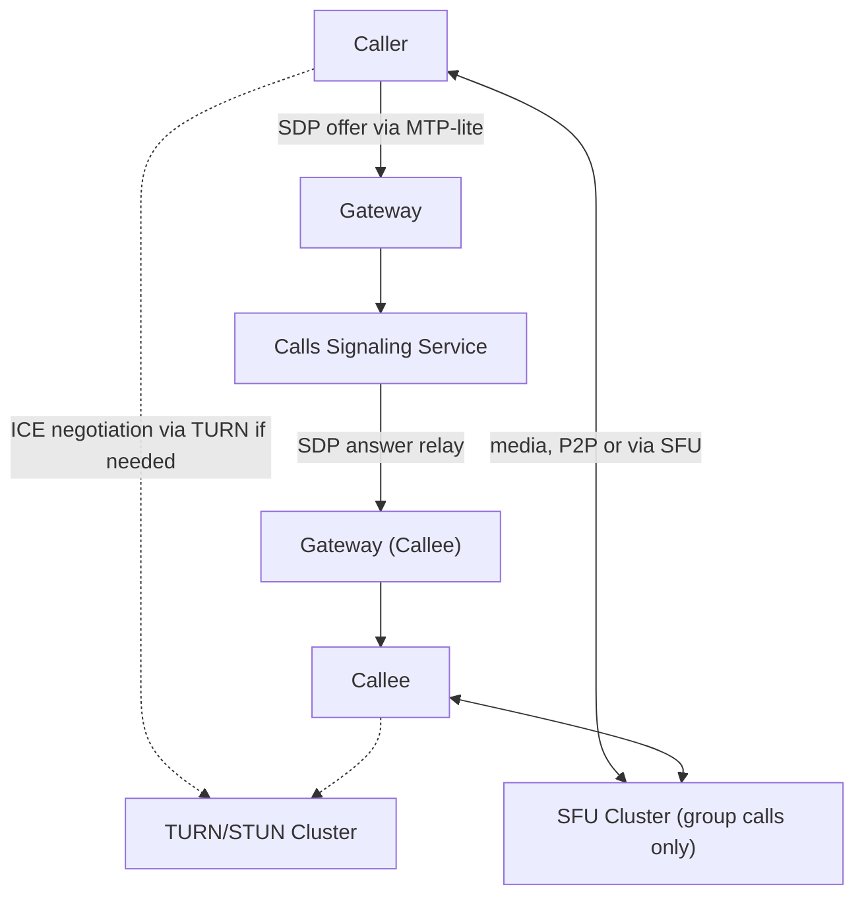

# Mesera — Phase 6: Voice & Video Calls

**Duration:** 9 weeks
**Depends on:** Phase 1 (transport for signaling), Phase 4 (media pipeline patterns reused for call recording, if implemented)
**Blocks:** Phase 8 (load/network testing depends on calls being complete)
**Primary owners:** Realtime Team, Frontend Team

---

## 1. Objective

Add real-time voice and video calling: 1:1 calls with peer-to-peer connectivity (TURN-relayed fallback for restrictive networks), and group calls routed through a Selective Forwarding Unit (SFU). This is the most technically distinct phase in the project — it's the one area where Mesera necessarily depends on WebRTC standards and, likely, an existing SFU rather than building everything in-house.

## 2. Scope

### In scope
- Signaling service (SDP/ICE relay over MTP-lite)
- STUN/TURN cluster integration
- 1:1 call state machine and frontend WebRTC integration
- SFU selection/build decision (ADR-005) and group call orchestration
- Group call grid UI and screen sharing
- Network-condition test matrix

### Out of scope
- Call recording/transcription (candidate for a post-launch feature)
- Live streaming (one-to-many broadcast video, distinct from group calls)

## 3. Phase Architecture Snapshot

## 4. Detailed Tasks

### P6-01 — Signaling Service

**Description:** Implement `calls-service::signaling`, which relays WebRTC session-description and ICE-candidate exchange between call participants over the existing MTP-lite transport rather than requiring a separate signaling channel.

**Subtasks:**
- Define signaling RPC/update types: `calls.requestCall`, `calls.acceptCall`, `calls.rejectCall`, `calls.hangup`, `calls.sendIceCandidate`, `update.incomingCall`
- Implement call session state storage (Redis, short-lived) tracking participants and call state
- Implement signaling relay logic: server never inspects/modifies SDP content, purely relays between the two (or more, for group) parties' gateways
- Implement call-not-answered timeout handling and busy/offline-callee handling

**Acceptance criteria:** Two test clients can exchange SDP offer/answer and ICE candidates entirely through the signaling service and successfully establish a WebRTC connection.

**Estimated effort:** 8 engineer-days.

---

### P6-02 — STUN/TURN Cluster Integration

**Description:** Stand up and integrate a STUN/TURN server cluster (coturn is the pragmatic industry-standard choice rather than building one from scratch) to enable NAT traversal and relay fallback when direct peer-to-peer connectivity isn't possible.

**Subtasks:**
- Deploy coturn via Helm/Terraform with time-limited credential generation (short-lived TURN credentials issued by `calls-service` per call, not static shared secrets, to limit abuse if a credential leaks)
- Configure TURN over both UDP and TCP/TLS (443) fallback, since some restrictive corporate/mobile networks block UDP entirely
- Load test TURN relay bandwidth capacity and plan regional TURN server placement to minimize relay latency
- Implement credential-issuance RPC (`calls.getTurnCredentials`) called by clients before initiating ICE negotiation

**Acceptance criteria:** A call between two clients on a network configuration that blocks direct P2P (simulated via a symmetric-NAT test environment) successfully connects via TURN relay.

**Estimated effort:** 6 engineer-days.

---

### P6-03 — 1:1 Call State Machine

**Description:** Implement the backend call lifecycle state machine (idle → ringing → connected → ended, with reject/timeout/cancel transitions), ensuring illegal state transitions are rejected and both parties' views of call state stay consistent.

**Subtasks:**
- Implement `CallState` enum and transition-validation logic as a well-tested pure state machine (isolated from I/O for easy unit testing)
- Implement concurrent-action handling (e.g., both parties hang up simultaneously; callee accepts just as caller cancels) with clearly defined resolution rules
- Implement call history recording (missed/answered/declined/duration) for the call log UI
- Property-based tests generating random valid/invalid transition sequences to verify the state machine never reaches an inconsistent state

**Acceptance criteria:** State machine property tests pass with no invalid-state reachability found; concurrent edge cases resolve deterministically and are covered by explicit test cases.

**Estimated effort:** 6 engineer-days.

---

### P6-04 — Frontend: 1:1 WebRTC Integration

**Description:** Implement the browser-side call experience using native `RTCPeerConnection` and `getUserMedia`/`getDisplayMedia` APIs, wired to the signaling service via `mtp-client.js`.

**Subtasks:**
- Implement `<mesera-call-overlay>`: incoming-call ringing UI, in-call UI (mute/camera-toggle/hangup controls, local video preview, remote video/audio rendering)
- Implement `RTCPeerConnection` setup: offer/answer creation, ICE candidate gathering and exchange via signaling RPCs, connection-state monitoring with automatic reconnection attempts on transient ICE failures
- Implement audio/video device selection UI (microphone/camera/speaker picker) using `navigator.mediaDevices.enumerateDevices`
- Implement call-quality indicators (based on `RTCPeerConnection.getStats()`) surfaced subtly in the UI (e.g., a "poor connection" banner)
- Implement PiP (Picture-in-Picture) floating overlay behavior on desktop, full-screen takeover on mobile

**Acceptance criteria:** Two browser clients complete a full 1:1 audio+video call with working mute/camera-toggle controls; call-quality degradation (simulated via network throttling) is reflected in the UI indicator.

**Estimated effort:** 10 engineer-days.

---

### P6-05 — SFU Selection/Build Decision (ADR-005)

**Description:** Resolve the build-vs-adopt decision deferred from Phase 0: evaluate mediasoup (Node.js-based, mature, widely deployed), Janus (C-based, plugin architecture), and a custom Rust SFU built on the `webrtc-rs` crate, against criteria including operational fit with the rest of the Rust-centric stack, performance, and team expertise.

**Subtasks:**
- Build minimal spikes against mediasoup and `webrtc-rs`-based custom SFU (Janus considered on paper unless the spikes are inconclusive) forwarding a 4-participant test call
- Benchmark CPU/memory per participant-stream and measure added latency introduced by the SFU hop
- Evaluate operational concerns: mediasoup requires a Node.js runtime in an otherwise all-Rust backend (operational inconsistency); a custom Rust SFU adds significant build/maintenance burden but fits the stack and team skill investment
- Write ADR-005 with the final recommendation

**Acceptance criteria:** ADR-005 merged with clear rationale and benchmark data; decision unblocks P6-06.

**Estimated effort:** 8 engineer-days (spike + evaluation).

---

### P6-06 — Group Call Orchestration

**Description:** Implement `calls-service::sfu_orchestrator`, which allocates SFU rooms, manages participant join/leave, and coordinates media routing for group calls, built against whichever SFU was chosen in P6-05.

**Subtasks:**
- Implement room allocation and lifecycle (create on first join, tear down when empty)
- Implement participant limits and graceful degradation messaging when a room is full
- Implement simulcast/layer selection logic if the chosen SFU supports it (sending multiple quality layers so the SFU can adapt per-receiver bandwidth without re-encoding) — significant for group call quality at scale
- Implement active-speaker detection (server-side, based on audio levels) to drive which participant tiles are prioritized/highlighted in the UI
- Integration test: 8 simulated participants join a group call room, verify all receive each other's streams correctly

**Acceptance criteria:** An 8-participant group call establishes correctly with all participants receiving all other streams; active-speaker detection correctly identifies the currently-talking participant in test scenarios.

**Estimated effort:** 10 engineer-days.

---

### P6-07 — Frontend: Group Call Grid UI & Screen Share

**Description:** Build the group call visual experience: a responsive participant grid, active-speaker highlighting, and screen-sharing support.

**Subtasks:**
- Implement `<mesera-call-grid>`: dynamic grid layout adapting tile size/count to participant count and viewport size (1-on-1 large view, up to a "many participants" scroll/paginated grid for larger calls)
- Implement active-speaker visual highlighting (border/glow) driven by the backend detection from P6-06 or client-side `getStats()` audio-level fallback
- Implement screen sharing via `getDisplayMedia`, replacing or adding a video track in the existing `RTCPeerConnection`, with a distinct "presenting" tile treatment
- Implement mobile-specific group call layout (simplified grid, swipeable participant carousel given limited screen space)

**Acceptance criteria:** Group call grid correctly adapts from 2 to 8+ participants; screen share is visible to all other participants with correct tile treatment; mobile layout is usable and matches the responsive design intent.

**Estimated effort:** 9 engineer-days.

---

### P6-08 — Network-Condition Test Matrix

**Description:** Systematically validate call quality and connection success across a matrix of network conditions representative of real-world usage, to hit the master plan's 98% call success rate target.

**Subtasks:**
- Build a test matrix: {good WiFi, throttled 3G-equivalent, high packet loss (5–10%), high jitter, symmetric NAT (TURN-forced), asymmetric NAT} × {1:1 call, group call}
- Use network-condition simulation tooling (`tc`/`netem` on Linux test runners, or browser dev-tools throttling for manual passes) to reproduce each condition
- Record connection success rate, audio/video quality (subjective + objective via WebRTC stats), and reconnection behavior for each matrix cell
- Triage and fix any condition falling below the 98% success target before Phase 6 sign-off

**Acceptance criteria:** Aggregate call success rate across the full test matrix meets or exceeds 98%, matching master plan Goal G8.

**Estimated effort:** 7 engineer-days.

---

## 5. Phase 6 Task Summary Table

| Task ID | Task | Est. Effort | Owner |
|---|---|---|---|
| P6-01 | Signaling service | 8d | Realtime/Infra |
| P6-02 | STUN/TURN cluster integration | 6d | Realtime/Infra + SRE |
| P6-03 | 1:1 call state machine | 6d | Realtime/Infra |
| P6-04 | Frontend: 1:1 WebRTC integration | 10d | Frontend |
| P6-05 | SFU selection/build decision | 8d | Realtime/Infra + Tech Lead |
| P6-06 | Group call orchestration | 10d | Realtime/Infra |
| P6-07 | Frontend: group call grid UI & screen share | 9d | Frontend |
| P6-08 | Network-condition test matrix | 7d | QA + Realtime |

**Total:** ~64 engineer-days (~9 weeks, accounting for the sequential dependency of P6-06 on the P6-05 decision, and P6-08 needing most other tasks complete first).

## 6. Exit Criteria (Definition of Done for Phase 6)

- [ ] 1:1 calls work reliably including TURN-relay fallback
- [ ] SFU decision made and documented (ADR-005)
- [ ] Group calls (8+ participants) establish correctly with active-speaker detection
- [ ] Screen sharing works in both 1:1 and group contexts
- [ ] Call success rate ≥ 98% across the full network-condition test matrix
- [ ] Call history correctly recorded and viewable

## 7. Phase-Specific Risks

| Risk | Mitigation |
|---|---|
| SFU build/adopt complexity underestimated (Risk R4 from master plan) | Time-boxed spike (P6-05) before commitment; fallback to a mature adopted SFU (mediasoup) if the custom Rust path proves too costly within the timebox |
| WebRTC cross-browser inconsistencies (Safari historically lags Chrome/Firefox in WebRTC feature support) | Explicit Safari/iOS testing throughout, not just at the end; maintain a documented list of known Safari limitations and graceful degradations |
| TURN relay bandwidth costs higher than budgeted if P2P fails often in practice | Monitor P2P-vs-relay ratio in production telemetry from day one; revisit regional TURN placement/capacity based on real data post-launch |
| Group call quality degrades non-linearly as participant count grows | Simulcast/layer-selection work in P6-06 is treated as a first-class requirement, not an optional optimization, given its outsized impact on perceived quality |
