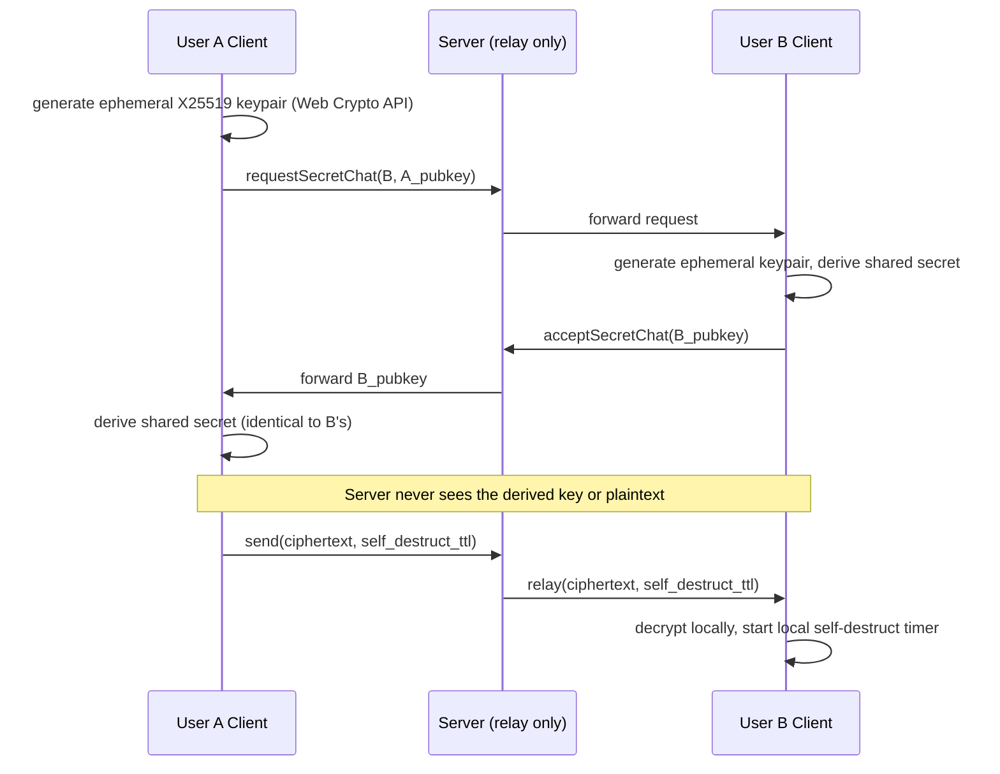

# Mesera — Phase 7: Secret Chats & Security Hardening

**Duration:** 7 weeks
**Depends on:** Phase 3 (chat UI to build the secret-chat mode into), Phase 2 (messaging service to extend with the secret-chat relay mode)
**Blocks:** Phase 8 launch readiness (security sign-off is a hard launch gate)
**Primary owners:** Security Engineer, Backend Team, Frontend Team

---

## 1. Objective

Deliver end-to-end encrypted Secret Chats, encryption-at-rest for regular cloud chats, and a full security hardening pass culminating in an external penetration test with all Critical/High findings closed — the last gate before the project can responsibly claim production readiness.

## 2. Scope

### In scope
- Client-side E2E key generation and ECDH key exchange (Web Crypto API)
- Server-side secret-chat relay (opaque ciphertext only)
- Self-destruct timer for secret messages
- Encryption at rest for cloud chat data (KMS envelope encryption)
- Internal threat-modeling workshop
- External penetration test and remediation
- GDPR-style data export/delete endpoints

### Out of scope
- Formal cryptographic proof/verification (a full formal-methods audit is out of scope for v1; the external pen test plus vetted-primitive-only policy is the chosen risk posture, documented as such)

## 3. Phase Architecture Snapshot

## 4. Detailed Tasks

### P7-01 — Client-Side E2E Key Generation

**Description:** Implement the browser-side cryptography for Secret Chats using the Web Crypto API (`crypto.subtle`), generating ephemeral key pairs per secret chat and deriving a shared session key via ECDH, without ever transmitting private key material.

**Subtasks:**
- Implement `secret-chat-crypto.js`: `generateKeyPair()`, `deriveSharedSecret(privateKey, peerPublicKey)`, `encryptMessage(key, plaintext)`, `decryptMessage(key, ciphertext)` using `crypto.subtle.deriveKey`/`encrypt`/`decrypt` with AES-GCM
- Implement local, non-exportable private key storage (IndexedDB, with the key material itself never leaving the Web Crypto API's opaque `CryptoKey` handles where possible, to reduce exposure to XSS-based key exfiltration)
- Implement key-fingerprint display (a human-verifiable code/emoji sequence derived from the shared secret) so users can optionally verify they're not victims of a MITM — a standard E2E messenger UX pattern
- Write test vectors and unit tests against known ECDH/AES-GCM outputs to guard against silent regressions

**Acceptance criteria:** Two browser clients derive an identical shared secret from independently generated ephemeral key pairs; key fingerprint matches on both sides for a legitimate (non-MITM'd) session.

**Estimated effort:** 8 engineer-days.

---

### P7-02 — Secret Chat Relay (Server-Side)

**Description:** Extend `messaging-service` with a secret-chat mode where the server stores and forwards only opaque ciphertext, with no server-side plaintext processing (no search indexing, no link-preview generation, no content moderation scanning — all capabilities that depend on visible plaintext are correctly and deliberately unavailable for secret chats, matching Telegram's model and being transparent to users about this trade-off).

**Subtasks:**
- Implement a `is_secret` flag on the chat record routing messages through a distinct code path that skips indexing/preview/moderation hooks
- Implement device-specific secret chats (per Telegram's actual model, a secret chat is bound to the specific device pair that created it, not synced across all of a user's devices, since the private key never leaves the originating device) — document this clearly in both backend logic and frontend UX copy
- Implement ciphertext storage with the same self-destruct TTL metadata as plaintext messages, but the server enforces deletion based on TTL without needing to understand content
- Integration test confirming no plaintext ever appears in server logs, database rows, or search index for secret-chat messages

**Acceptance criteria:** Automated test inspects server-side storage/logs after a secret chat exchange and confirms zero plaintext leakage; device-binding behavior verified (a second device of the same user does not receive the secret chat).

**Estimated effort:** 7 engineer-days.

---

### P7-03 — Self-Destruct Timer

**Description:** Implement the self-destruct-after-read/after-time feature for secret messages, enforced on both client (immediate local deletion) and server (guaranteed eventual ciphertext deletion even if a client never confirms).

**Subtasks:**
- Implement client-side countdown timer UI, starting either on delivery or on read depending on the message's configured mode, with local message deletion (including from IndexedDB cache) when the timer expires
- Implement server-side TTL enforcement: a background sweep job deletes expired ciphertext rows even absent client confirmation, as a durability backstop
- Implement screenshot-detection best-effort warning (where browser APIs allow signal, e.g., visibility/focus-change heuristics — explicitly documented as best-effort/non-guaranteed, matching the honest limitations of any web-based screenshot "detection")
- Test edge cases: client offline when timer expires, multiple messages with different TTLs in the same chat

**Acceptance criteria:** Messages reliably disappear from both client and server storage at or before their configured expiry, verified even when the client is offline at expiry time (server-side sweep catches it).

**Estimated effort:** 5 engineer-days.

---

### P7-04 — Encryption at Rest for Cloud Chat Data

**Description:** Implement envelope encryption for regular (non-secret) cloud chat message content at the database layer, using a KMS-managed key hierarchy, so that a raw database compromise doesn't directly expose plaintext message history.

**Subtasks:**
- Set up KMS (cloud provider KMS or self-hosted via Vault's Transit secrets engine) with a key hierarchy: a root key protects per-tenant or per-shard data encryption keys (DEKs), DEKs are rotated periodically
- Implement application-layer encrypt/decrypt wrapping around message body writes/reads in `messaging-service` (encryption happens in the service, not pushed down to the database engine, to keep the design portable across the chosen data stores)
- Implement key rotation procedure (re-encrypt-on-read pattern, or a background re-encryption job, avoiding a disruptive one-shot migration)
- Benchmark the performance overhead of the added encrypt/decrypt step to confirm it doesn't meaningfully regress the latency SLOs established in Phase 2

**Acceptance criteria:** Direct inspection of the message store shows only ciphertext; decrypt path correctly round-trips; latency overhead measured and confirmed within acceptable bounds (< 5ms p95 added latency, target).

**Estimated effort:** 8 engineer-days.

---

### P7-05 — Internal Threat Modeling Workshop

**Description:** Run a structured internal threat-modeling exercise (e.g., STRIDE-based) covering the full system, cross-referencing against the threat table already drafted in master plan §10.3, to surface anything missed and produce a signed-off baseline threat model document ahead of the external pen test.

**Subtasks:**
- Schedule a multi-session workshop with Security Engineer, Tech Lead, and one representative from each sub-team (Backend, Frontend, Realtime, SRE)
- Walk each major data flow (login, message send, media upload, call signaling, secret chat handshake) through STRIDE categories
- Document findings, assign owners and remediation tasks for anything actionable before the external pen test (to avoid wasting expensive external pen-test time on issues the team already knows about)
- Produce the final threat model document, reviewed and signed off by the Tech Lead and Security Engineer

**Acceptance criteria:** Threat model document merged; all findings triaged with owners and target dates; no unaddressed Critical findings remain before P7-06 begins.

**Estimated effort:** 6 engineer-days (distributed across workshop participants) + 3 days Security Engineer write-up.

---

### P7-06 — External Penetration Test & Remediation

**Description:** Engage a reputable external security firm to perform a black-box and grey-box penetration test against the staging environment (with production-equivalent configuration), covering the web client, API surface, and infrastructure, then remediate all findings before launch.

**Subtasks:**
- Scope and contract the pen test engagement (define target systems, test window, rules of engagement, explicitly including the MTP-lite protocol and Secret Chat crypto as in-scope areas given their custom/non-standard nature)
- Provide the firm with the threat model document from P7-05 as context (grey-box approach, more efficient than pure black-box for a system this complex)
- Triage incoming findings by severity as they arrive, not just at the final report; begin remediation on Critical/High findings immediately rather than waiting for the full report
- Remediate all Critical/High findings; document risk-acceptance rationale for any lower-severity findings deliberately deferred
- Request a re-test/verification pass from the firm confirming remediations are effective

**Acceptance criteria:** Final pen test report shows zero open Critical/High findings, verified by the firm's re-test.

**Estimated effort:** 15 engineer-days (remediation work, spread across the team; the pen test engagement itself runs on the vendor's timeline, typically 2–3 weeks calendar time in parallel with other Phase 7/8 work).

---

### P7-07 — GDPR Export/Delete Endpoints

**Description:** Implement `account.exportData` and `account.deleteAccount`, giving users self-service access to a full export of their data and the ability to permanently delete their account and associated data, as required by GDPR-style regulations referenced in master plan §10.4.

**Subtasks:**
- Implement `account.exportData`: asynchronous job (data volume may be large) that compiles a user's profile, chat list, message history (in chats they're a member of, respecting other members' expectations — export includes the requesting user's own messages and metadata, not a full copy of others' private content beyond what they'd naturally see), and media references into a downloadable archive, delivered via a signed URL and/or email notification when ready
- Implement `account.deleteAccount`: cascading deletion (or anonymization where cascading deletion would break other users' chat history integrity — e.g., a deleted user's past messages in a group chat are typically retained but the identity is anonymized, matching common messenger conventions and legal guidance) with a confirmation/cooling-off flow to prevent accidental irreversible action
- Implement audit logging of export/delete requests themselves (who requested, when, completion status)
- Legal review of the export/delete behavior with whatever legal counsel/compliance function the organization has, to confirm the anonymization-vs-cascading-deletion approach meets actual regulatory obligations in target markets

**Acceptance criteria:** A test user can request and receive a complete data export, and can delete their account with correct anonymization behavior for chat history shared with other users.

**Estimated effort:** 8 engineer-days + legal review time (external to engineering estimate).

---

## 5. Phase 7 Task Summary Table

| Task ID | Task | Est. Effort | Owner |
|---|---|---|---|
| P7-01 | Client-side E2E key generation | 8d | Frontend + Security |
| P7-02 | Secret chat relay (server-side) | 7d | Backend |
| P7-03 | Self-destruct timer | 5d | Backend + Frontend |
| P7-04 | Encryption at rest for cloud chat data | 8d | Backend + SRE |
| P7-05 | Internal threat modeling workshop | 6d (distributed) + 3d | Security Engineer |
| P7-06 | External pen test & remediation | 15d (remediation) | All teams + Security |
| P7-07 | GDPR export/delete endpoints | 8d | Backend |

**Total:** ~60 engineer-days of direct work, but calendar duration (7 weeks) is driven primarily by the external pen test vendor's engagement timeline running partially in parallel with the other tasks.

## 6. Exit Criteria (Definition of Done for Phase 7)

- [ ] Secret Chats are provably E2E encrypted with no server-side plaintext exposure
- [ ] Self-destruct timers reliably enforced on both client and server
- [ ] Cloud chat data encrypted at rest with a working key-rotation procedure
- [ ] Internal threat model document signed off
- [ ] External pen test complete with zero open Critical/High findings (verified by re-test)
- [ ] GDPR export/delete endpoints functional and legally reviewed

## 7. Phase-Specific Risks

| Risk | Mitigation |
|---|---|
| Custom E2E crypto implementation flaw (Risk R5 from master plan — rated Critical impact) | Vetted primitives only (Web Crypto API, no custom cipher/KDF construction), explicit in-scope inclusion in the external pen test, no shortcuts on P7-01's test-vector coverage |
| External pen test surfaces late-breaking Critical findings that threaten the Phase 8 timeline | Grey-box approach with early threat-model sharing (P7-05 feeds P7-06) to surface issues earlier; triage-as-you-go rather than waiting for the final report |
| GDPR anonymization-vs-deletion approach doesn't meet actual legal requirements in target markets | Explicit legal review step in P7-07, not just an engineering assumption |
| Self-destruct timer server-side sweep job has a bug allowing "expired" ciphertext to persist indefinitely | Dedicated automated test for the offline-client expiry scenario, plus a monitoring alert on sweep-job failure/backlog |
