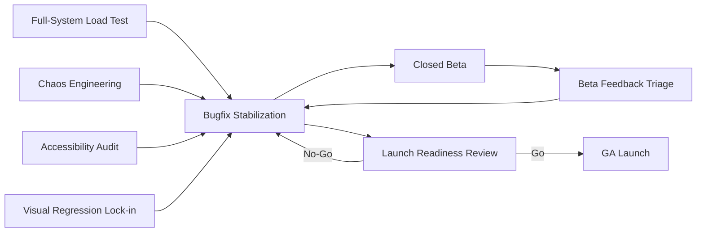

# Mesera — Phase 8: Hardening & Launch

**Duration:** 6 weeks (partially overlapping with the tail end of Phases 6/7)
**Depends on:** All prior phases substantially complete
**Blocks:** GA launch
**Primary owners:** SRE Team, QA Team, Tech Lead, Product

---

## 1. Objective

Prove, under realistic conditions, that Mesera is actually ready for real users at target scale: full-system load testing, chaos/resilience testing, accessibility compliance, visual regression lock-in, a closed beta with real feedback, and a final go/no-go launch readiness review. This phase does not add product features — it validates and stabilizes everything built in Phases 0–7.

## 2. Scope

### In scope
- Full-system load test at Year-1-proportional target scale
- Chaos engineering pass
- Accessibility audit (WCAG 2.1 AA)
- Visual regression baseline
- Closed beta program
- Bugfix stabilization sprints
- Launch readiness review
- GA launch execution

### Out of scope
- Any new product features (explicitly frozen for this phase, per the scope-creep mitigation in master plan Risk R10 — anything discovered as "missing" during beta goes to a post-launch backlog unless it's a launch-blocking correctness/safety issue)

## 3. Phase Flow

## 4. Detailed Tasks

### P8-01 — Full-System Load Test

**Description:** Run a comprehensive load test exercising every major subsystem simultaneously — messaging, media upload, search, calls, push — at a scale proportional to the launch target from master plan §18.1, going meaningfully beyond the isolated per-subsystem load tests already done in earlier phases (Phase 2's messaging-only test, Phase 6's calls-only matrix, etc.).

**Subtasks:**
- Extend the Rust WS load harness and `k6` scripts into a combined scenario generator simulating realistic mixed user behavior (most connections idle/occasionally messaging, a smaller fraction actively in calls, a smaller fraction uploading media, background search queries)
- Run the combined scenario at the launch target concurrency (50,000 peak concurrent WS connections per master plan §18.1) for a sustained multi-hour window
- Monitor all SLOs from master plan §12.3 simultaneously and identify any cross-subsystem resource contention that wasn't visible in isolated per-phase tests (e.g., transcode workers starving CPU needed by the gateway on shared nodes)
- Produce a comprehensive load test report with pass/fail against every SLO and a prioritized list of any needed follow-up tuning

**Acceptance criteria:** All SLOs from master plan §12.3 met simultaneously under combined realistic load for the full test duration.

**Estimated effort:** 8 engineer-days (harness extension + execution + analysis).

---

### P8-02 — Chaos Engineering Pass

**Description:** Deliberately inject failures into the staging environment to validate the system degrades gracefully and recovers automatically, rather than assuming resilience based on architecture alone.

**Subtasks:**
- Kill random pods of each service type during active load test traffic, verify Kubernetes reschedules and the system recovers without data loss or extended user-facing outage
- Simulate a Postgres primary failover, verify the application layer handles the brief unavailability gracefully (retries, not crashes/corrupts) and correctly resumes against the new primary
- Simulate a network partition between a subset of gateway nodes and a core service, verify circuit breakers (built in Phase 1's P1-05) engage correctly rather than cascading failures
- Simulate Redis data loss (relevant given Phase 2's message-ID counter design explicitly built a reconciliation path for this — verify it actually works under this more realistic full-system chaos scenario, not just the isolated Phase 2 test)
- Document findings as a resilience runbook: what breaks, what self-heals, and manual intervention procedures for anything that doesn't

**Acceptance criteria:** System recovers from every injected failure scenario without data loss and within an acceptable recovery time objective (RTO); resilience runbook published.

**Estimated effort:** 7 engineer-days.

---

### P8-03 — Accessibility Audit

**Description:** Formally audit the web client against WCAG 2.1 AA, combining automated tooling with manual assistive-technology testing, since automated tools alone catch only a fraction of real accessibility issues.

**Subtasks:**
- Run `axe-core` automated scans across every major screen/component built in Phases 3–6, triage and fix all flagged issues
- Manual screen reader pass (VoiceOver on macOS/iOS, NVDA or JAWS on Windows) through the core flows: login, browse chat list, read/send a message, start a call
- Manual keyboard-only navigation pass (no mouse) verifying every interactive element is reachable and operable, with visible focus indicators matching the design tokens
- Color contrast audit against the design token palette (particularly the dark and night-blue themes, which are more prone to contrast issues than light themes)
- Fix all identified issues; where a fix isn't feasible before launch, document a specific remediation timeline rather than silently deferring

**Acceptance criteria:** Zero WCAG 2.1 AA violations in automated scans; manual screen-reader and keyboard-only passes complete core flows successfully; sign-off documented.

**Estimated effort:** 8 engineer-days (audit + fixes, spread across Frontend team with Accessibility specialist input if available).

---

### P8-04 — Visual Regression Baseline Lock-in

**Description:** Establish an automated visual regression test suite comparing rendered UI against the Telegram-parity design checklist from master plan §9, so future changes can't silently drift from the intended visual design without an explicit, reviewed diff.

**Subtasks:**
- Capture Playwright screenshot baselines for every screen/state in the reference screen inventory (master plan §9.4), across all three themes and the four responsive breakpoints
- Wire pixel-diff comparison into CI, failing (or requiring explicit review/approval) on unexpected visual changes
- Conduct a final manual side-by-side design QA pass against the Figma parity checklist, sign-off from the product designer
- Document the baseline-update process for legitimate future intentional visual changes (so the suite doesn't become a maintenance burden that gets disabled out of frustration)

**Acceptance criteria:** Full baseline suite established and passing; design QA sign-off obtained; baseline-update process documented.

**Estimated effort:** 6 engineer-days.

---

### P8-05 — Closed Beta Program

**Description:** Run a closed beta with a real (but limited and consenting) user population to surface issues that internal testing structurally can't — real-world device diversity, real network conditions, real usage patterns, and real content.

**Subtasks:**
- Recruit a beta cohort (target size proportional to team's support capacity — large enough for meaningful signal, small enough to triage feedback effectively)
- Set up a feedback intake channel (in-app feedback affordance + a dedicated support channel) and a lightweight crash/error reporting pipeline feeding into the existing observability stack
- Run the beta for a defined window (e.g., 2 weeks), monitoring usage telemetry and actively soliciting structured feedback, not just waiting for organic reports
- Triage all incoming feedback into a prioritized backlog: launch-blocking bugs, post-launch backlog items, and out-of-scope requests (explicitly communicated back to beta users where appropriate, to maintain trust)

**Acceptance criteria:** Beta completes with a triaged, prioritized issue list; no unaddressed launch-blocking issues remain by the end of the beta window.

**Estimated effort:** 10 engineer-days (program management + issue investigation, distributed across the team) over a 2-week calendar window.

---

### P8-06 — Bugfix Stabilization Sprints

**Description:** Dedicated sprint capacity to burn down the prioritized issue list from load testing, chaos testing, accessibility audit, visual regression, and the closed beta — explicitly protected from new feature work per this phase's scope freeze.

**Subtasks:**
- Maintain a single triaged backlog across all Phase 8 validation activities, ranked by severity and launch-blocking status
- Run focused stabilization sprints with the whole team pulled toward bug-fixing rather than parallel feature tracks
- Re-run relevant validation (re-run the specific load test scenario, re-scan accessibility, etc.) after fixes to confirm resolution rather than assuming a code change fixed the underlying issue
- Track and report Critical/High open-bug count daily as the primary phase-progress metric

**Acceptance criteria:** Critical/High open bug count reaches zero and stays at zero for a sustained period (e.g., one full week with no new Critical/High regressions) before proceeding to the launch readiness review.

**Estimated effort:** Variable, sized by the volume of findings from P8-01 through P8-05; budgeted at approximately 15–20 engineer-days as a planning baseline, adjusted based on actual findings.

---

### P8-07 — Launch Readiness Review

**Description:** A formal go/no-go review bringing together SRE, Security, Product, and Engineering leadership to confirm every launch gate has been met before committing to GA.

**Subtasks:**
- Compile a launch readiness checklist covering: all SLOs met (P8-01), resilience validated (P8-02), accessibility signed off (P8-03), visual QA signed off (P8-04), beta feedback resolved (P8-05/06), security pen test closed (Phase 7's P7-06), on-call rotation and runbooks in place, rollback plan documented and rehearsed
- Conduct a rollback rehearsal: practice the actual production rollback procedure in staging to confirm it works, not just that it's documented
- Hold the formal review meeting with explicit go/no-go decision recorded
- If no-go, identify the specific blocking items and a revised timeline; loop back to P8-06

**Acceptance criteria:** Formal go decision recorded with every checklist item confirmed complete.

**Estimated effort:** 4 engineer-days (checklist compilation, rollback rehearsal) + review meeting time.

---

### P8-08 — GA Launch

**Description:** Execute the production launch: progressive rollout per the CI/CD canary strategy established in Phase 0 (master plan §12.1), with active monitoring throughout.

**Subtasks:**
- Execute canary rollout (5% → 25% → 100%) with explicit go/no-go checks between each stage based on live error rates and latency
- Staff active on-call coverage for the launch window and immediate aftermath (heightened monitoring period, e.g., 72 hours post-launch)
- Monitor all SLO dashboards in real time during rollout; halt/rollback immediately if any stage shows SLO violation
- Publish a post-launch report summarizing rollout health and any issues encountered, feeding lessons learned back into the team's operating practices

**Acceptance criteria:** 100% rollout completed with SLOs maintained throughout; no rollback triggered (or, if triggered, successfully executed and the underlying issue subsequently fixed and re-attempted).

**Estimated effort:** 3 engineer-days of active execution + heightened on-call coverage for the surrounding window.

---

## 5. Phase 8 Task Summary Table

| Task ID | Task | Est. Effort | Owner |
|---|---|---|---|
| P8-01 | Full-system load test | 8d | SRE + QA |
| P8-02 | Chaos engineering pass | 7d | SRE |
| P8-03 | Accessibility audit | 8d | Frontend + QA |
| P8-04 | Visual regression baseline lock-in | 6d | Frontend + Design |
| P8-05 | Closed beta program | 10d (2-week window) | Product + All teams |
| P8-06 | Bugfix stabilization sprints | ~15–20d (variable) | All teams |
| P8-07 | Launch readiness review | 4d + meeting | Tech Lead + SRE + Security |
| P8-08 | GA launch | 3d + on-call window | SRE + Tech Lead |

**Total:** ~61–66 engineer-days of direct work, with calendar duration (6 weeks) shaped significantly by the closed beta's fixed window and the need for sequential validate → fix → re-validate cycles rather than pure task-parallelism.

## 6. Exit Criteria (Definition of Done for Phase 8, and for the Project)

- [ ] Full-system load test passes all SLOs under combined realistic load
- [ ] Chaos engineering confirms graceful degradation and recovery for all tested failure modes
- [ ] WCAG 2.1 AA compliance confirmed via automated and manual testing
- [ ] Visual regression baseline established and design QA signed off
- [ ] Closed beta complete with all launch-blocking issues resolved
- [ ] Critical/High open bug count at zero, sustained
- [ ] Launch readiness review returns a formal "Go" decision
- [ ] GA rollout completed successfully with SLOs maintained

## 7. Phase-Specific Risks

| Risk | Mitigation |
|---|---|
| Combined full-system load test surfaces cross-subsystem contention not visible in any single earlier phase's isolated test | This is precisely why P8-01 is scoped as a distinct, mandatory task rather than assuming earlier phase load tests were sufficient |
| Beta feedback volume overwhelms the team's triage capacity within the fixed beta window | Cap beta cohort size to a level proportional to the team's realistic support capacity; have the triage process and intake tooling ready before the beta starts, not built reactively during it |
| Launch readiness review surfaces a late blocking issue, delaying GA | Budget explicit rollback-rehearsal and buffer time in the schedule (the 6-week phase duration includes contingency); prefer delaying launch over launching against an unresolved Critical finding, consistent with the project's stated risk posture throughout |
| Scope creep during beta ("just one more feature before launch") | Explicit scope freeze stated in this phase's objective, enforced by the same PM/Tech Lead change-control process referenced in master plan Risk R10 |
