# Mesera — Technical Project Plan

**Project codename:** Mesera
**Type:** Full-featured messenger platform (Telegram-equivalent clone)
**Backend:** Rust
**Frontend (Web, fully mobile-responsive):** Vanilla JavaScript (no framework)
**Document version:** 1.0
**Status:** Draft for engineering kickoff

---

## Table of Contents

1. Executive Summary
2. Goals, Non-Goals, and Success Criteria
3. High-Level System Architecture
4. Technology Stack
5. Backend Architecture (Rust)
6. Data Layer & Database Design
7. Realtime Protocol & API Specification
8. Frontend Architecture (Vanilla JS)
9. UI/UX — Visual Parity with Telegram
10. Security, Privacy & Encryption Design
11. Media Pipeline (Photos, Video, Voice, Files, Stickers, GIFs)
12. Infrastructure, DevOps & Observability
13. Testing Strategy & Quality Gates
14. Project Phases & Roadmap
15. Detailed Work Breakdown Structure (WBS)
16. Team Structure & Responsibilities
17. Risk Register
18. Non-Functional Requirements & Capacity Planning
19. Glossary
20. Appendices

---

## 1. Executive Summary

Mesera is a from-scratch reimplementation of a Telegram-class instant messaging platform. The system must reproduce Telegram's core product surface — private chats, group chats, channels/broadcast, voice/video calls, bots, stickers/GIFs, secret (E2E-encrypted) chats, cloud-synced multi-device sessions, and a pixel-close visual/interaction clone of the Telegram web client — while being built entirely in-house on a Rust backend and a dependency-free vanilla JavaScript frontend.

The plan below decomposes the project into 8 delivery phases across roughly 14 months for a team of 14–18 engineers, with explicit stage gates, a full backend service topology, database schema, wire protocol, frontend architecture, and a granular work breakdown structure (WBS) suitable for sprint planning in Jira/Linear.

Key architectural decisions made up front:

- **Custom binary protocol over WebSocket** (Mesera Transport Protocol, "MTP-lite") for realtime updates, modeled conceptually on MTProto's layered design (auth-key handshake, encrypted transport, update sequencing), but implemented independently in Rust.
- **Microservice-oriented monorepo** using Cargo workspaces, with services split by bounded context (Auth, Presence, Messaging, Chats, Media, Push, Calls signaling, Bots, Search).
- **Event-sourced message pipeline** backed by a distributed log (Kafka or NATS JetStream) to guarantee ordered, at-least-once delivery and enable independent read-model projections (per-device update feeds).
- **PostgreSQL** as the system of record (sharded by user_id range in later phases), **ScyllaDB/Cassandra-style wide-column store** for message history at scale, **Redis** for session/presence/rate-limit state, **S3-compatible object storage** (MinIO self-hosted or AWS S3) for media.
- **Vanilla JS frontend** built as a modular ES2022 application (native ES Modules, no bundler required for dev, esbuild for production bundling), using Web Components for reusable UI, CSS Grid/Flexbox for a fully responsive layout replicating Telegram Desktop/Web breakpoints (three-column ⇄ two-column ⇄ single-column collapse).

---

## 2. Goals, Non-Goals, and Success Criteria

### 2.1 Goals

| # | Goal | Acceptance Signal |
|---|------|--------------------|
| G1 | Feature parity with Telegram's core messaging (1:1, groups up to 200k members, channels/broadcast) | All P0 features in §14 shipped and passing acceptance tests |
| G2 | Sub-150ms p95 message delivery latency within a region | Load test report, §18 |
| G3 | Full mobile-responsive web client with no separate mobile codebase | Single JS codebase renders correctly at 320px–2560px |
| G4 | Visual and interaction parity with Telegram Web (K version) | Design QA sign-off against Figma parity checklist |
| G5 | End-to-end encrypted "Secret Chats" plus server-side encryption at rest for cloud chats | Security audit passed, §10 |
| G6 | Horizontal scalability to 10M MAU / 250k concurrent WS connections per region | Capacity model in §18 validated in staging |
| G7 | Bot Platform (HTTP Bot API compatible subset) | 20 reference bots built and passing integration suite |
| G8 | Voice & video calls (1:1, P2P with TURN fallback; group calls via SFU) | Call success rate ≥ 98% in QA network matrix |

### 2.2 Non-Goals (v1)

- Native iOS/Android apps (web client must be installable as a PWA and "good enough" on mobile browsers; native apps are a future phase, not in this plan).
- Telegram Premium-equivalent monetization features.
- Federation/interop with real Telegram servers or protocol.
- Blockchain/TON-related features.

### 2.3 Definition of Done (project-level)

- All services pass CI (unit + integration + contract tests) with ≥ 80% line coverage on core crates.
- Load test sustains target concurrency for 4 hours with error rate < 0.1%.
- Security review (internal + external pen test) closed with no Critical/High findings open.
- Accessibility pass: WCAG 2.1 AA for the web client.

---

## 3. High-Level System Architecture

### 3.1 Context Diagram

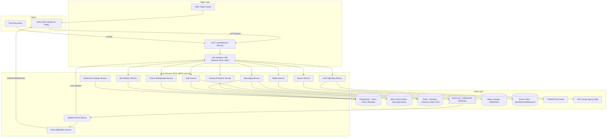

### 3.2 Deployment Topology (per region)

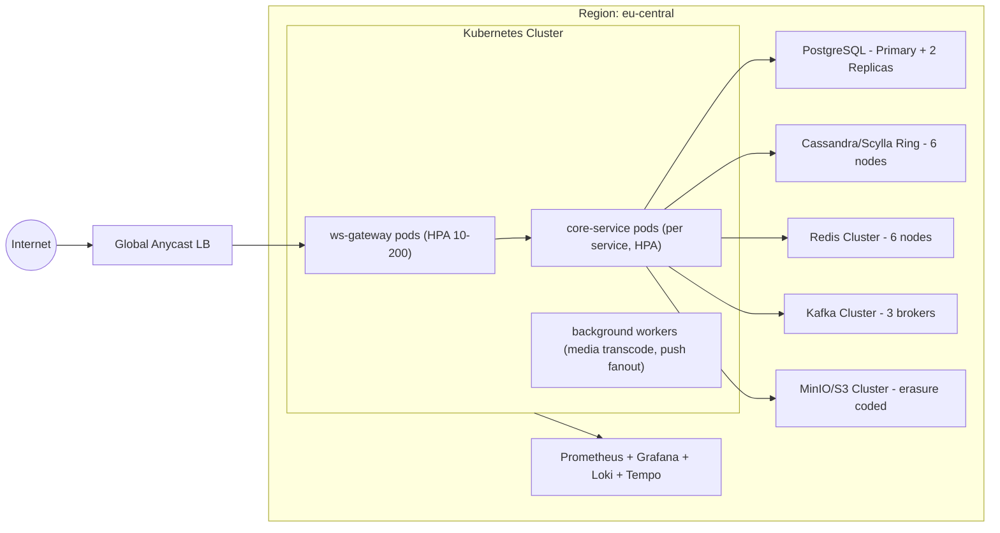

### 3.3 Bounded Contexts (Domain-Driven Design)

| Bounded Context | Responsibility | Owning Team |
|---|---|---|
| Identity & Auth | Phone/email verification, login, session/device management, 2FA | Platform Team |
| Chats & Membership | 1:1 chats, groups, channels, permissions, roles, invite links | Messaging Team |
| Messaging Core | Message CRUD, delivery, ordering, read receipts, reactions, edits | Messaging Team |
| Update Fanout | Per-device update queue, long-poll/WS delivery, offline catch-up | Realtime Team |
| Media | Upload, transcode, thumbnailing, CDN distribution | Media Team |
| Search | Full-text search over messages/contacts/chats | Search Team |
| Calls | Signaling, ICE negotiation, SFU orchestration for group calls | Realtime Team |
| Bots | Bot registration, webhook/long-poll delivery, Bot API surface | Platform Team |
| Push | APNs/FCM/WebPush integration, notification payload building | Platform Team |
| Notification Settings | Mute, custom sounds, per-chat notification prefs | Platform Team |

---

## 4. Technology Stack

### 4.1 Backend

| Layer | Technology | Notes |
|---|---|---|
| Language | Rust (stable, MSRV pinned per release) | Workspace of ~15 crates |
| Async runtime | Tokio | Multi-threaded scheduler |
| Web/RPC framework | `axum` (HTTP/REST + WS upgrade), `tonic` (internal gRPC) | axum for gateway, tonic for service-to-service |
| Serialization | `serde` + `bincode`/`protobuf` (internal), `serde_json` (public REST) | Custom binary framing for realtime protocol |
| ORM/DB access | `sqlx` (compile-time checked SQL) for Postgres; `scylla` crate for Scylla | No heavyweight ORM; hand-tuned queries |
| Caching | `redis` crate, `deadpool-redis` for pooling | Cluster mode client |
| Message bus | `rdkafka` (Kafka) or `async-nats` (NATS JetStream) | Decision gate in Phase 1 (§14) |
| Auth/crypto | `ring`, `x25519-dalek`, `aes-gcm`, `argon2`, custom Diffie-Hellman handshake for MTP-lite | No OpenSSL FFI dependency where avoidable |
| Observability | `tracing`, `tracing-opentelemetry`, `metrics` crate | Exported to Prometheus/Tempo |
| Testing | `tokio::test`, `proptest`, `insta` (snapshot), `wiremock` | Contract tests via `pact-rust` (optional) |
| Migrations | `sqlx-cli` migrations | Versioned SQL migration files |
| Build/CI | Cargo workspace, `cargo-nextest`, `cargo-deny`, `cargo-audit` | Reproducible builds, dependency audit gate |

### 4.2 Frontend

| Layer | Technology | Notes |
|---|---|---|
| Language | Vanilla JavaScript (ES2022), no framework | Native ES Modules |
| Component model | Custom lightweight Web Components (`HTMLElement` + Shadow DOM where beneficial) | Reusable, framework-free |
| State management | Custom reactive store (Proxy-based observable pattern) | ~300 LOC hand-rolled micro-library, documented in §8 |
| Styling | Plain CSS3 (CSS Custom Properties, Grid, Flexbox, Container Queries) | No CSS framework, design tokens system |
| Build tooling | `esbuild` for prod bundling/minification, native ESM for dev | No webpack/Vite runtime dependency |
| Realtime transport | Native `WebSocket` API + binary `ArrayBuffer` framing matching MTP-lite | Fallback to long-polling via `fetch` |
| Media | `MediaStream`/`WebRTC` APIs, `OffscreenCanvas` for image processing, `Web Workers` for decoding | |
| PWA | Service Worker (Cache API, Background Sync, Push API) | Installable, offline shell |
| Testing | `web-test-runner` + `@open-wc/testing`, Playwright for E2E | |

### 4.3 Infrastructure

| Category | Technology |
|---|---|
| Orchestration | Kubernetes (EKS/GKE or self-managed) |
| IaC | Terraform + Helm charts |
| CI/CD | GitHub Actions / GitLab CI, ArgoCD for GitOps deploys |
| Secrets | HashiCorp Vault |
| Object storage | MinIO (self-hosted) / S3 |
| CDN | Cloudflare / Fastly |
| Observability stack | Prometheus, Grafana, Loki, Tempo, Alertmanager |
| Load testing | `k6`, custom Rust WS load harness |

---

## 5. Backend Architecture (Rust)

### 5.1 Cargo Workspace Layout

```
mesera-backend/
├── Cargo.toml                 # workspace root
├── crates/
│   ├── mtp-protocol/          # wire protocol types, encoding/decoding, crypto handshake
│   ├── mtp-gateway/           # axum-based WS/HTTP gateway, connection mgmt
│   ├── auth-service/
│   ├── session-service/
│   ├── chat-service/
│   ├── messaging-service/
│   ├── update-fanout-service/
│   ├── media-service/
│   ├── search-service/
│   ├── push-service/
│   ├── calls-service/
│   ├── bot-platform-service/
│   ├── notification-service/
│   ├── common-db/             # shared sqlx/scylla pool setup, migrations
│   ├── common-telemetry/      # tracing/metrics init helpers
│   ├── common-auth/           # shared token verification, permission checks
│   └── proto/                 # .proto definitions compiled via tonic-build
└── deploy/
    ├── helm/
    └── terraform/
```

### 5.2 Service Interaction — Message Send Flow

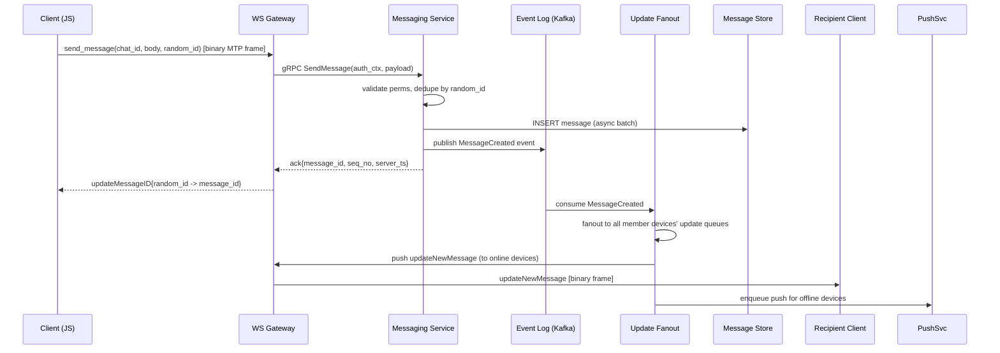

### 5.3 Core Crate Responsibilities

| Crate | Responsibility | Key Modules |
|---|---|---|
| `mtp-protocol` | Defines all wire types (TL-schema-like), varint/length-prefixed binary codec, AES-GCM-256 transport encryption, DH key exchange | `schema.rs`, `codec.rs`, `crypto.rs` |
| `mtp-gateway` | Terminates WS/HTTP, per-connection actor, auth handshake, routes RPCs to internal services via gRPC, maintains update subscription | `connection.rs`, `router.rs`, `handshake.rs` |
| `auth-service` | Phone/email verification (SMS/email provider abstraction), password + 2FA, session issuance, device registration | `verification.rs`, `sessions.rs`, `twofa.rs` |
| `session-service` | Active session listing, presence (online/last-seen), multi-device sync tokens | `presence.rs`, `devices.rs` |
| `chat-service` | Chat/group/channel CRUD, membership, roles/permissions, invite links, admin logs | `chats.rs`, `members.rs`, `permissions.rs` |
| `messaging-service` | Message send/edit/delete, reactions, replies, forwarding, drafts, read receipts | `send.rs`, `edit.rs`, `reactions.rs`, `read_state.rs` |
| `update-fanout-service` | Per-device update sequence numbers, offline queue, catch-up (`getDifference`-style sync) | `fanout.rs`, `sequence.rs`, `catchup.rs` |
| `media-service` | Chunked upload, resumable upload sessions, transcoding orchestration, thumbnail generation | `upload.rs`, `transcode.rs`, `cdn_publish.rs` |
| `search-service` | Indexing pipeline consumer, query API, ranking | `indexer.rs`, `query.rs` |
| `push-service` | APNs/FCM/WebPush adapters, payload templating, retry/backoff | `apns.rs`, `fcm.rs`, `webpush.rs` |
| `calls-service` | SDP/ICE relay, call state machine, SFU room allocation | `signaling.rs`, `sfu_orchestrator.rs` |
| `bot-platform-service` | Bot token issuance, webhook delivery, Bot API method dispatch | `bot_api.rs`, `webhook.rs` |
| `notification-service` | Per-chat mute/sound settings storage and lookup | `settings.rs` |
| `common-db` | Connection pooling, migration runner, retry/backoff policies | `pg_pool.rs`, `scylla_pool.rs` |
| `common-auth` | JWT/opaque-token verification middleware shared across services | `token.rs`, `middleware.rs` |

### 5.4 Internal Communication

- **Client ⇄ Gateway:** binary MTP-lite frames over WebSocket (primary), REST/JSON fallback for simple request/response calls (login, file upload init) to ease debugging and bot integrations.
- **Gateway ⇄ Services:** gRPC (via `tonic`) with Protobuf contracts, mutual TLS within the cluster, deadlines + retries with exponential backoff, circuit breaker (via `tower` middleware stack).
- **Services ⇄ Event Log:** Kafka topics partitioned by `chat_id` hash to preserve per-chat ordering; consumer groups per downstream service.

### 5.5 Connection & Actor Model (Gateway)

Each WebSocket connection is modeled as an isolated Tokio task ("connection actor") communicating with a per-user "session hub" task via `mpsc` channels. This avoids shared mutable state and lets a single user with multiple devices fan updates out cleanly.

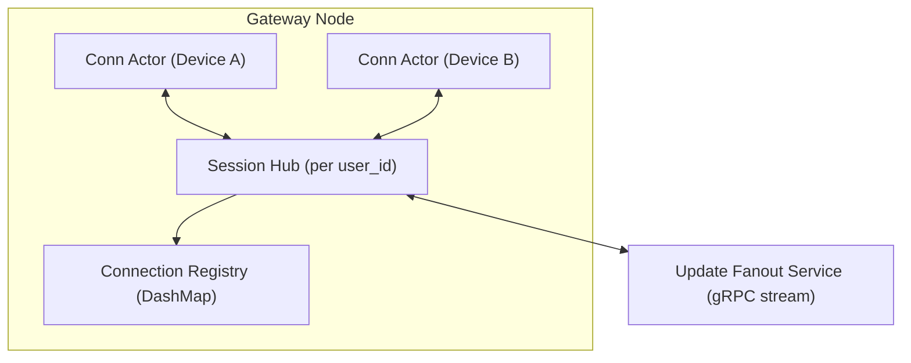

---

## 6. Data Layer & Database Design

### 6.1 Storage Strategy

| Data Category | Store | Rationale |
|---|---|---|
| Users, auth, sessions, chat metadata, permissions | PostgreSQL | Strong consistency, relational integrity, mature tooling |
| Message history (hot + cold) | Wide-column store (ScyllaDB) | Write-heavy, time-series-like access pattern, horizontal scale |
| Presence, rate limits, ephemeral tokens, update sequence cursors | Redis | Low-latency, TTL-native |
| Media blobs | S3-compatible object storage | Durable, cheap, CDN-friendly |
| Search index | OpenSearch/Meilisearch | Full-text + fuzzy search |
| Event log (durable queue) | Kafka / NATS JetStream | Ordered, replayable, decouples producers/consumers |

### 6.2 PostgreSQL Entity-Relationship Diagram (core schema)

```mermaid
erDiagram
    USERS ||--o{ SESSIONS : has
    USERS ||--o{ DEVICES : owns
    USERS ||--o{ CHAT_MEMBERS : joins
    CHATS ||--o{ CHAT_MEMBERS : contains
    CHATS ||--o{ CHATS : "linked_channel(optional)"
    USERS ||--o{ CONTACTS : "owner"
    USERS ||--o{ BLOCKED_USERS : blocks
    CHATS ||--o{ INVITE_LINKS : has
    USERS ||--o{ BOTS : creates
    CHATS ||--o{ ADMIN_LOG : logs
    USERS ||--o{ NOTIFICATION_SETTINGS : configures
    CHATS ||--o{ PINNED_MESSAGES : has

    USERS {
        uuid id PK
        string phone_number UK
        string username UK
        string first_name
        string last_name
        string bio
        string avatar_file_id FK
        bool two_fa_enabled
        timestamptz created_at
        timestamptz last_seen_at
        enum privacy_last_seen
        enum privacy_photo
        enum privacy_calls
    }

    SESSIONS {
        uuid id PK
        uuid user_id FK
        uuid device_id FK
        string auth_key_hash
        inet ip_address
        string app_name
        timestamptz created_at
        timestamptz last_active_at
        bool revoked
    }

    DEVICES {
        uuid id PK
        uuid user_id FK
        enum platform
        string push_token
        string public_key
    }

    CHATS {
        uuid id PK
        enum type "private|group|supergroup|channel"
        string title
        string about
        string avatar_file_id FK
        uuid creator_id FK
        int member_count
        bool is_public
        string username UK
        timestamptz created_at
    }

    CHAT_MEMBERS {
        uuid chat_id FK
        uuid user_id FK
        enum role "owner|admin|member|restricted|banned"
        jsonb permissions
        timestamptz joined_at
        int last_read_message_id
    }

    CONTACTS {
        uuid owner_id FK
        uuid contact_user_id FK
        string local_alias
        timestamptz added_at
    }

    BLOCKED_USERS {
        uuid owner_id FK
        uuid blocked_user_id FK
        timestamptz blocked_at
    }

    INVITE_LINKS {
        uuid id PK
        uuid chat_id FK
        string link_hash UK
        uuid created_by FK
        int usage_limit
        int usage_count
        timestamptz expires_at
    }

    BOTS {
        uuid id PK
        uuid owner_id FK
        string bot_token_hash
        string webhook_url
        jsonb command_list
    }

    ADMIN_LOG {
        uuid id PK
        uuid chat_id FK
        uuid actor_id FK
        enum action_type
        jsonb details
        timestamptz created_at
    }

    NOTIFICATION_SETTINGS {
        uuid user_id FK
        uuid chat_id FK
        bool muted
        timestamptz muted_until
        string custom_sound
    }

    PINNED_MESSAGES {
        uuid chat_id FK
        bigint message_id
        timestamptz pinned_at
    }
```

### 6.3 Message Store Schema (ScyllaDB / Cassandra CQL model)

Messages are partitioned by `chat_id` and clustered by `message_id` (server-assigned, monotonically increasing per chat via a Redis-backed counter or Scylla lightweight transaction) to give natural pagination and ordering without secondary indexes.

| Table | Partition Key | Clustering Key | Notes |
|---|---|---|---|
| `messages_by_chat` | `chat_id` | `message_id DESC` | Primary message storage; wide partition, paginated reads |
| `messages_by_id` | `message_id` | — | Lookup table for reply/forward resolution |
| `message_edits` | `message_id` | `edited_at DESC` | Edit history for audit/undo |
| `reactions_by_message` | `message_id` | `user_id` | Reaction aggregation |
| `read_state_by_chat_user` | `(chat_id, user_id)` | — | Last-read message pointer per member |
| `updates_by_device` | `device_id` | `seq_no DESC` | Per-device offline update queue (TTL-capped) |

Representative column layout for `messages_by_chat`:

| Column | Type | Description |
|---|---|---|
| `chat_id` | uuid | Partition key |
| `message_id` | bigint | Clustering key, monotonic per chat |
| `sender_id` | uuid | Author |
| `type` | tinyint | text/photo/video/voice/sticker/system |
| `body` | text | Encrypted or plaintext body depending on chat type |
| `entities` | blob (protobuf) | Markdown/formatting entities (bold, links, mentions) |
| `media_ref` | text (nullable) | Media service file_id |
| `reply_to_message_id` | bigint (nullable) | |
| `forward_from` | blob (nullable) | Origin metadata |
| `edited_at` | timestamp (nullable) | |
| `deleted` | boolean | Soft delete flag |
| `server_ts` | timestamp | Authoritative ordering timestamp |

### 6.4 Redis Key Design

| Key Pattern | Purpose | TTL |
|---|---|---|
| `presence:{user_id}` | online/last-seen state | 60s sliding |
| `session:{session_id}` | auth session cache | 24h |
| `ratelimit:{user_id}:{bucket}` | token-bucket rate limiting | rolling window |
| `seq:{chat_id}` | atomic message_id counter per chat | none |
| `typing:{chat_id}:{user_id}` | typing indicator | 6s |
| `otp:{phone_number}` | one-time login code | 5 min |

---

## 7. Realtime Protocol & API Specification

### 7.1 Transport Design Philosophy

Mesera Transport Protocol ("MTP-lite") is a custom binary protocol inspired conceptually by MTProto's separation of *transport*, *encryption*, and *application schema* layers, but is an original design implemented in `mtp-protocol`. It runs over a single persistent WebSocket per device.

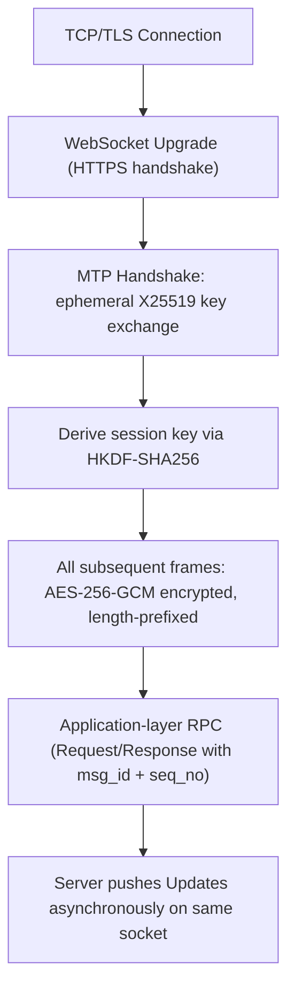

### 7.2 Frame Format

| Field | Size | Description |
|---|---|---|
| `magic` | 2 bytes | Protocol version marker |
| `length` | 4 bytes | Payload length |
| `msg_id` | 8 bytes | Unique per-request id (client-generated, monotonic) |
| `seq_no` | 4 bytes | Server-assigned update sequence (0 for requests) |
| `flags` | 1 byte | Encrypted / compressed / ack-required bits |
| `payload` | variable | Encrypted Protobuf-encoded application message |
| `auth_tag` | 16 bytes | AES-GCM authentication tag |

### 7.3 Core RPC Methods (subset)

| Method | Direction | Description |
|---|---|---|
| `auth.sendCode` | C→S | Request SMS/email verification code |
| `auth.signIn` | C→S | Complete login with code + optional 2FA |
| `auth.logOut` | C→S | Revoke current session |
| `chats.create` | C→S | Create group/channel |
| `chats.getDialogs` | C→S | Fetch chat list with pagination |
| `messages.send` | C→S | Send a message (text/media/sticker) |
| `messages.edit` | C→S | Edit existing message |
| `messages.delete` | C→S | Delete message(s) |
| `messages.getHistory` | C→S | Paginated message history fetch |
| `messages.markRead` | C→S | Update read pointer |
| `updates.getDifference` | C→S | Catch-up sync after reconnect/offline gap |
| `media.initUpload` | C→S | Begin chunked upload session |
| `media.uploadPart` | C→S | Upload a chunk |
| `calls.requestCall` | C→S | Initiate 1:1 call, exchange SDP offer |
| `bots.sendMessage` | C→S (Bot API, REST) | REST equivalent for bot integrations |
| `update.newMessage` | S→C | Push new message event |
| `update.messageEdited` | S→C | Push edit event |
| `update.chatMemberUpdated` | S→C | Membership change |
| `update.typing` | S→C | Typing indicator |
| `update.presenceChanged` | S→C | Online/last-seen change |

### 7.4 REST/HTTP Surface (Bot API + Auxiliary)

A parallel REST/JSON API (versioned `/api/v1/...`) exists for: (a) third-party bot integrations expecting Telegram-Bot-API-style semantics, (b) simple stateless calls where WS is unnecessary (e.g., OG-preview link unfurling), and (c) file download via signed CDN URLs.

| Endpoint | Method | Description |
|---|---|---|
| `/api/v1/bot/{token}/sendMessage` | POST | Bot sends message to chat |
| `/api/v1/bot/{token}/getUpdates` | GET | Long-poll updates for bot |
| `/api/v1/bot/{token}/setWebhook` | POST | Register webhook URL |
| `/api/v1/files/{file_id}` | GET | Download media (signed, CDN-fronted) |
| `/api/v1/auth/qr` | POST | QR-code login session creation |
| `/api/v1/health` | GET | Liveness/readiness probe |

### 7.5 Offline Catch-Up (getDifference) Sequence

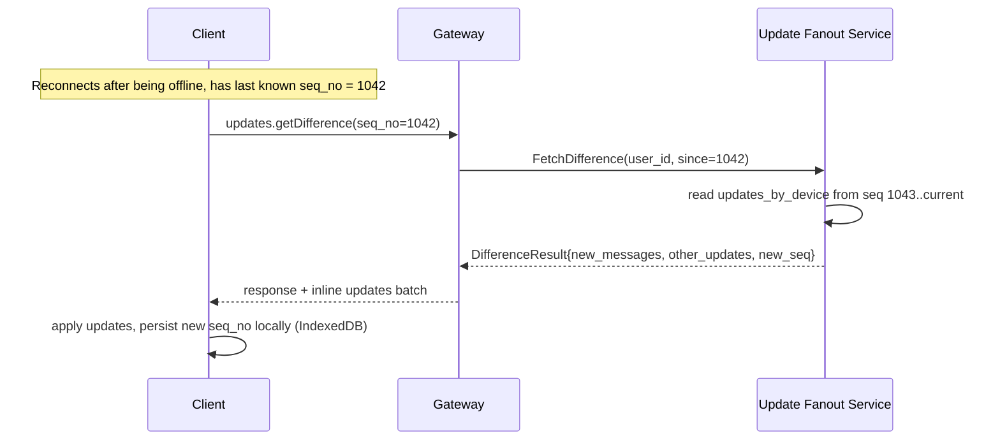

---

## 8. Frontend Architecture (Vanilla JS)

### 8.1 Design Principles

- No external UI framework/runtime. All interactivity implemented with native DOM APIs, Custom Elements, and a small hand-written reactive layer (~2–3 KLOC total "framework" code, fully owned and documented).
- Progressive enhancement: the app shell loads instantly from cache (Service Worker), then hydrates chat data from IndexedDB, then reconciles with the server over WS.
- Strict module boundaries mirroring backend bounded contexts (auth, chats, messaging, media, calls, search, settings).

### 8.2 Module/Folder Structure

```
mesera-web/
├── index.html
├── src/
│   ├── core/
│   │   ├── store.js          # Proxy-based reactive state container
│   │   ├── router.js         # Hash/History API SPA router
│   │   ├── mtp-client.js      # WebSocket client, frame encode/decode
│   │   ├── idb.js             # IndexedDB wrapper (chat cache, media cache)
│   │   └── event-bus.js
│   ├── components/
│   │   ├── chat-list/
│   │   ├── chat-window/
│   │   ├── message-bubble/
│   │   ├── composer/
│   │   ├── sidebar/
│   │   ├── modal/
│   │   ├── avatar/
│   │   ├── sticker-panel/
│   │   ├── call-overlay/
│   │   └── settings-panel/
│   ├── features/
│   │   ├── auth/
│   │   ├── chats/
│   │   ├── messaging/
│   │   ├── media-upload/
│   │   ├── calls/
│   │   ├── search/
│   │   └── notifications/
│   ├── styles/
│   │   ├── tokens.css         # design tokens (colors, spacing, radii)
│   │   ├── layout.css
│   │   ├── themes/
│   │   │   ├── light.css
│   │   │   └── dark.css
│   │   └── components/
│   ├── workers/
│   │   ├── sw.js               # service worker
│   │   ├── media-decode.worker.js
│   │   └── search-index.worker.js
│   └── main.js
└── build/ (esbuild output)
```

### 8.3 Reactive State Model

A minimal observable store built on `Proxy` traps notifies subscribed Web Components on state mutation, avoiding virtual-DOM diffing overhead:

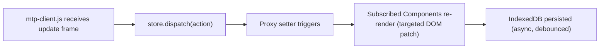

### 8.4 Component Inventory (Telegram-parity UI)

| Component | Telegram Equivalent | Responsive Behavior |
|---|---|---|
| `<mesera-sidebar>` | Left chat list column | Full width < 600px; fixed 420px column ≥ 600px |
| `<mesera-chat-window>` | Center message pane | Hidden until chat selected on mobile; always visible ≥ 900px |
| `<mesera-message-bubble>` | Message bubble (in/out styles) | Max-width 70% of pane, reflows on resize |
| `<mesera-composer>` | Bottom input bar with attach/emoji/mic | Sticky bottom, safe-area-inset aware |
| `<mesera-sticker-panel>` | Sticker/GIF/emoji picker | Full-screen sheet on mobile, popover on desktop |
| `<mesera-call-overlay>` | In-call UI | Full-screen on mobile, floating PiP on desktop |
| `<mesera-settings-panel>` | Right-side settings drawer | Full-screen sheet < 900px; 3rd column ≥ 1200px |
| `<mesera-context-menu>` | Right-click/long-press menu | Long-press triggers on touch, right-click on desktop |
| `<mesera-avatar>` | Circular avatar w/ gradient fallback | Fixed aspect ratio, lazy-loaded |
| `<mesera-modal>` | Dialogs (forward, delete confirm) | Bottom sheet on mobile, centered modal on desktop |

### 8.5 Responsive Breakpoint Table

| Breakpoint | Width Range | Layout |
|---|---|---|
| `xs` | 0–599px | Single column, full-screen navigation stack (list → chat → info) |
| `sm` | 600–899px | Two-column (list + chat), settings as overlay |
| `md` | 900–1199px | Two-column, wider chat pane |
| `lg` | 1200px+ | Three-column (list + chat + info/settings), Telegram Desktop-style |

### 8.6 Offline-First Sync Flow

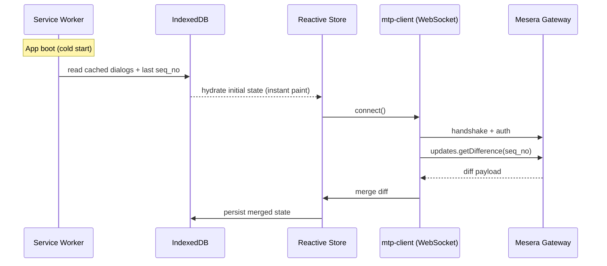

---

## 9. UI/UX — Visual Parity with Telegram

### 9.1 Design Token System

| Token Category | Examples |
|---|---|
| Color | `--mesera-accent-blue`, `--mesera-bubble-out-bg`, `--mesera-bubble-in-bg`, `--mesera-bg-primary`, `--mesera-bg-secondary` |
| Typography | `--font-family-base` (system font stack matching Telegram: `-apple-system, "Segoe UI", Roboto`), `--font-size-message`, `--font-size-name` |
| Spacing | `--space-xs (4px)` through `--space-xl (32px)`, 4px base grid |
| Radius | `--radius-bubble (18px)`, `--radius-avatar (50%)`, `--radius-panel (10px)` |
| Elevation | `--shadow-panel`, `--shadow-modal` |
| Motion | `--ease-standard (cubic-bezier(0.4,0,0.2,1))`, `--duration-fast (120ms)`, `--duration-medium (240ms)` |

### 9.2 Theming

- Light / Dark / "Night Blue" themes, all defined as CSS custom property sets swapped via `data-theme` attribute on `<html>`.
- Custom chat wallpaper support (solid color, gradient, pattern, user-uploaded image) stored as a CSS `background-image` layer behind the message list.
- Bubble tail rendering via clipped pseudo-elements/SVG masks to match Telegram's rounded-bubble-with-tail shape exactly.

### 9.3 Interaction Parity Checklist

| Interaction | Requirement |
|---|---|
| Message send | Enter sends (Shift+Enter newline) on desktop; send button + swipe-to-reply on touch |
| Reply swipe | Horizontal swipe-right on a bubble reveals reply affordance (touch), hover reveals reply icon (desktop) |
| Long-press/right-click | Opens context menu with copy/reply/forward/delete/pin/react |
| Double-tap/click reaction | Double-click desktop, double-tap mobile applies default reaction (❤️) |
| Sticker/GIF panel | Tabbed panel (Recent, Stickers, GIFs, Emoji) with search |
| Typing indicator | Animated three-dot bubble, name label in groups |
| Read receipts | Single check (sent), double check (delivered/read), matching Telegram iconography |
| Unread divider | "Unread Messages" separator line on first unread on chat open |
| Scroll-to-bottom FAB | Floating button appears when scrolled up with unread count badge |
| Message grouping | Consecutive messages from same sender within 5 min collapse avatar/name |
| Link previews | Fetched server-side (OG tags), rendered as card below message text |
| Voice message waveform | Canvas-rendered waveform generated client-side from decoded audio |

### 9.4 Reference Screen Inventory (for design/build handoff)

| Screen | States to Implement |
|---|---|
| Auth — phone entry | Default, validation error, loading |
| Auth — code entry | Default, resend countdown, error |
| Chat list | Empty, populated, search-active, archived-folder |
| Chat window | Empty state, loading history, populated, pinned message bar |
| Composer | Idle, recording voice, media-attached preview, reply-preview active |
| Media viewer | Photo, video (with scrubber), document preview |
| Group info | Members list, admin permissions editor, invite link management |
| Settings root | Profile, Privacy, Notifications, Data & Storage, Appearance |
| Call screen | Ringing, connected, screen-share active, group call grid |

---

## 10. Security, Privacy & Encryption Design

### 10.1 Encryption Layers

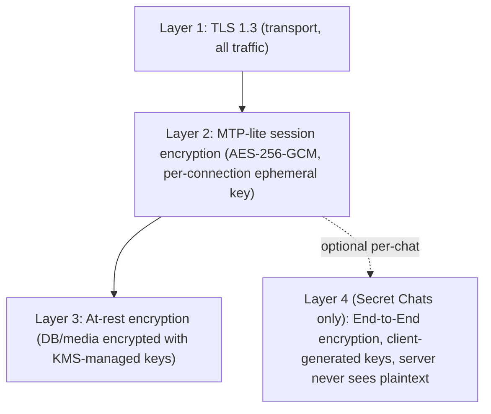

### 10.2 Secret Chat E2E Handshake

```mermaid
sequenceDiagram
    participant A as User A (initiator)
    participant S as Server (relay only)
    participant B as User B

    A->>S: requestSecretChat(B_user_id, A_ephemeral_pubkey)
    S->>B: forward request + A_ephemeral_pubkey
    B->>B: generate ephemeral keypair, compute shared secret (X25519)
    B->>S: acceptSecretChat(B_ephemeral_pubkey)
    S->>A: forward B_ephemeral_pubkey
    A->>A: compute shared secret (X25519 ECDH)
    Note over A,B: Both derive identical session key via HKDF; server never learns it
    A->>S: send(ciphertext) [server only routes opaque bytes]
    S->>B: relay(ciphertext)
    B->>B: decrypt locally
```

### 10.3 Threat Model Summary

| Threat | Mitigation |
|---|---|
| Credential stuffing / brute-force login | Rate limiting (Redis token bucket), progressive backoff, CAPTCHA after N failures |
| Session hijacking | Short-lived access tokens + refresh tokens, device-bound session keys, "terminate all sessions" self-service |
| Man-in-the-middle | TLS 1.3 pinning on client, certificate transparency monitoring |
| Message tampering in transit | AES-GCM authenticated encryption (integrity tag) at MTP layer |
| Server compromise exposing message content | Secret Chats are E2E so server compromise doesn't expose those; cloud chats encrypted at rest with envelope encryption (KMS) to limit blast radius |
| Spam/bot abuse | Rate limits per action type, ML-assisted spam scoring (future phase), report/block pipeline |
| Media hotlinking/leakage | Signed, expiring CDN URLs; access-controlled file_ids scoped to chat membership |
| Insider data access | Audit logging (admin_log table), least-privilege DB roles, Vault-managed secrets, no plaintext secrets in code/config |
| DDoS on gateway | Cloudflare/Fastly edge protection, connection rate limiting per IP, SYN cookies at LB |
| Replay attacks on RPC | `msg_id` monotonicity + server-side replay cache with TTL window |

### 10.4 Compliance & Data Handling

- GDPR-style data export/delete endpoints (`account.exportData`, `account.deleteAccount`) required from Phase 3 onward.
- PII (phone numbers) stored hashed/encrypted at column level in Postgres using `pgcrypto`, decrypted only in-service via KMS-wrapped keys.
- Audit trail retention: 180 days for admin actions, configurable per deployment.

---

## 11. Media Pipeline

### 11.1 Upload Flow

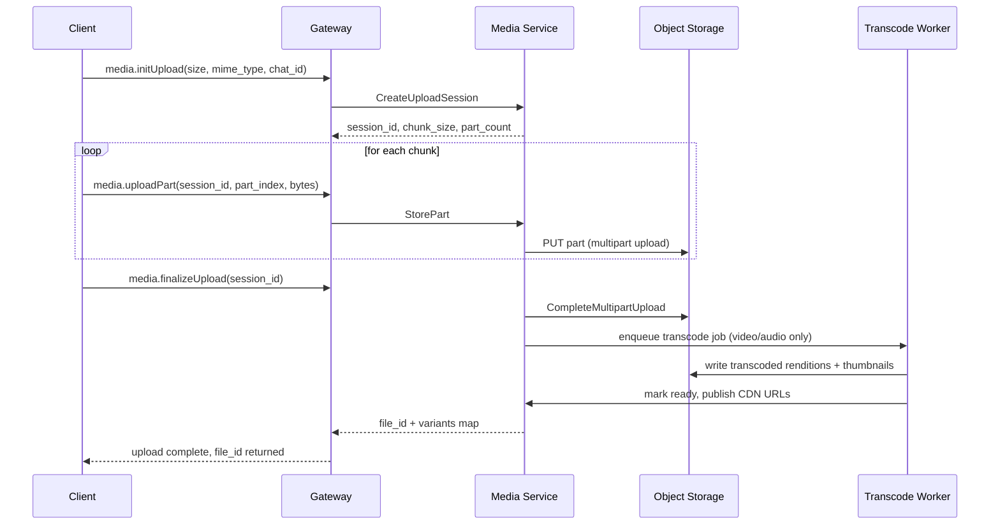

### 11.2 Media Variant Matrix

| Media Type | Server Processing | Output Variants |
|---|---|---|
| Photo | Resize, EXIF strip, WebP + JPEG fallback | thumb (90px), preview (320px), full (2560px max) |
| Video | Transcode to H.264/AAC MP4, generate poster frame | 360p, 720p, original (if ≤ limit) |
| Voice message | Transcode to Opus/OGG, waveform peaks extraction | single rendition + waveform JSON |
| Sticker | Validate WebP/TGS(animated) format, generate static preview | static thumb + animated original |
| Document/file | Virus scan (ClamAV integration), MIME sniffing | original only, with preview icon by type |
| GIF | Convert to muted MP4 for efficient looping playback | MP4 loop + static thumb |

---

## 12. Infrastructure, DevOps & Observability

### 12.1 CI/CD Pipeline

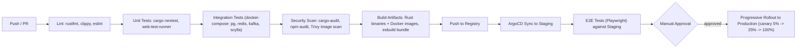

### 12.2 Observability Stack

| Signal | Tool | Notes |
|---|---|---|
| Metrics | Prometheus + Grafana | Per-service RED metrics (Rate, Errors, Duration), custom business metrics (messages/sec, active WS connections) |
| Logs | Loki + `tracing` structured JSON logs | Correlated via `trace_id` |
| Traces | Tempo + OpenTelemetry | End-to-end request tracing across gateway → service → DB |
| Alerting | Alertmanager → PagerDuty/Opsgenie | SLO-based burn-rate alerts |
| Synthetic monitoring | k6 + scheduled canary scripts | Login, send-message, media-upload smoke tests every 5 min |

### 12.3 SLOs

| Service | SLI | Target |
|---|---|---|
| Message send | p95 end-to-end latency | < 150ms intra-region |
| WS Gateway | Connection success rate | > 99.9% |
| Media upload | p95 time-to-first-byte on CDN after finalize | < 5s for 10MB video |
| Auth | Login success rate | > 99.95% |
| Overall API | Availability | 99.9% monthly |

---

## 13. Testing Strategy & Quality Gates

| Test Layer | Scope | Tooling | Owner |
|---|---|---|---|
| Unit | Individual functions/modules (Rust crates, JS components) | `cargo test`/`nextest`, `web-test-runner` | Feature engineers |
| Property-based | Protocol codec round-trips, permission logic | `proptest` | Backend engineers |
| Contract | gRPC/REST schema compatibility between services | `pact-rust` or schema diffing in CI | Platform team |
| Integration | Multi-service flows against docker-compose stack | Custom Rust test harness | QA + backend |
| E2E | Full user journeys in real browser | Playwright | QA team |
| Load/Performance | WS concurrency, message throughput | `k6`, custom Rust load generator | SRE/Performance team |
| Security | Static analysis, dependency audit, pen test | `cargo-audit`, `cargo-deny`, Trivy, external pen test firm | Security team |
| Accessibility | WCAG 2.1 AA compliance | axe-core, manual screen reader pass | Frontend team |
| Visual regression | Pixel-diff against Telegram-parity baselines | Playwright screenshot diffing | Design QA |

---

## 14. Project Phases & Roadmap

### 14.1 Timeline Overview

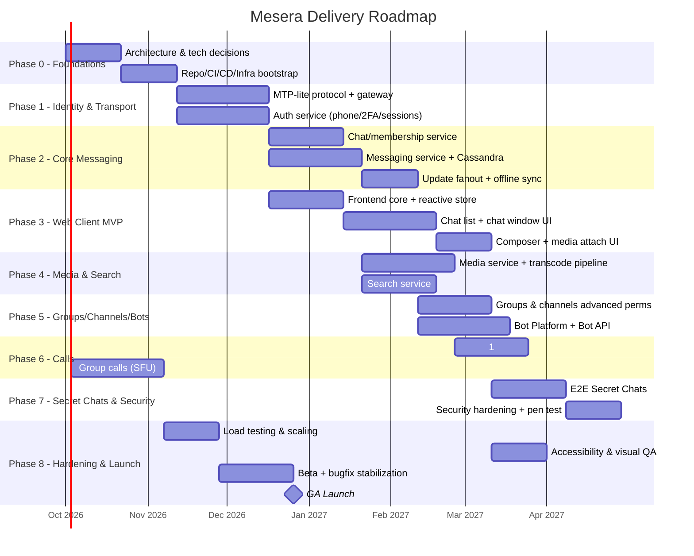

### 14.2 Phase Summary Table

| Phase | Duration | Primary Deliverable | Exit Criteria |
|---|---|---|---|
| 0 — Foundations | 6 weeks | Repo, CI/CD, IaC, service skeletons | `cargo build` + `helm install` succeed in staging for a hello-world service |
| 1 — Identity & Transport | 5 weeks | MTP-lite protocol, gateway, auth service | Client can connect, authenticate, hold persistent session |
| 2 — Core Messaging | 8 weeks | Chats, messaging, update fanout | Two clients exchange messages in real time with correct ordering |
| 3 — Web Client MVP | 8 weeks | Functional web UI for 1:1 and group chat | Manual QA can send/receive/edit/delete messages via UI |
| 4 — Media & Search | 7 weeks | Media upload/transcode, search | Photo/video/voice send + full-text search working |
| 5 — Groups/Channels/Bots | 7 weeks | Advanced permissions, channels, Bot API | 20 reference bots pass integration suite |
| 6 — Calls | 9 weeks | 1:1 and group calls | Call success rate ≥ 98% in QA matrix |
| 7 — Secret Chats & Security | 7 weeks | E2E encryption, security hardening | External pen test closed with no Critical/High |
| 8 — Hardening & Launch | 6 weeks (overlapping) | Load-tested, accessible, GA-ready | SLOs met under sustained load test; GA sign-off |

**Total estimated calendar duration:** ~13.5–15 months with parallelized phases across specialized sub-teams (see §16).

---

## 15. Detailed Work Breakdown Structure (WBS)

### 15.1 Phase 0 — Foundations

| Task ID | Task | Deliverable |
|---|---|---|
| P0-01 | Finalize event log choice (Kafka vs NATS JetStream) via spike + benchmark | Decision doc |
| P0-02 | Set up Cargo workspace skeleton with all crate stubs | Compilable monorepo |
| P0-03 | Provision Terraform modules: VPC, K8s cluster, managed Postgres, Redis, Kafka | `terraform apply` in staging |
| P0-04 | Build base Docker images (Rust distroless, Node/esbuild) | Images in registry |
| P0-05 | Configure GitHub Actions/GitLab CI pipelines (lint/test/build) | Passing pipeline on `main` |
| P0-06 | Stand up Prometheus/Grafana/Loki/Tempo stack via Helm | Dashboards accessible |
| P0-07 | Establish design token system + Figma-to-CSS pipeline | `tokens.css` v1 |
| P0-08 | Write architecture decision records (ADRs) for protocol, DB sharding strategy, auth model | ADR-001..ADR-010 |

### 15.2 Phase 1 — Identity & Transport

| Task ID | Task | Deliverable |
|---|---|---|
| P1-01 | Design and document MTP-lite binary schema (message types, versioning strategy) | `mtp-protocol` schema spec |
| P1-02 | Implement frame codec (encode/decode, varints, length-prefixing) | `mtp-protocol::codec` with property tests |
| P1-03 | Implement X25519 handshake + AES-GCM session encryption | `mtp-protocol::crypto` with test vectors |
| P1-04 | Build WS gateway connection actor model (tokio tasks, mpsc channels) | `mtp-gateway` connection handling |
| P1-05 | Implement gRPC router from gateway to internal services | `mtp-gateway::router` |
| P1-06 | Build phone/email verification flow (SMS provider integration, code TTL) | `auth-service::verification` |
| P1-07 | Implement session/device registration + JWT/opaque token issuance | `auth-service::sessions` |
| P1-08 | Implement 2FA (TOTP + recovery email) | `auth-service::twofa` |
| P1-09 | Frontend: implement `mtp-client.js` WS handshake + frame encode/decode | JS module with unit tests |
| P1-10 | Frontend: build auth screens (phone entry, code entry, profile setup) | Functional auth UI |
| P1-11 | Integration test: end-to-end login flow client↔gateway↔auth-service | Passing integration suite |

### 15.3 Phase 2 — Core Messaging

| Task ID | Task | Deliverable |
|---|---|---|
| P2-01 | Design Postgres schema for chats/members/permissions; write migrations | Migration files applied |
| P2-02 | Implement `chat-service` CRUD + membership APIs | gRPC service passing contract tests |
| P2-03 | Design Scylla schema for message storage (partitioning strategy validated via load test) | Schema + benchmark report |
| P2-04 | Implement `messaging-service` send/edit/delete/reactions | gRPC service with unit + integration tests |
| P2-05 | Implement per-chat monotonic message_id counters (Redis or Scylla LWT) | Verified no-collision under concurrency test |
| P2-06 | Implement Kafka producer in messaging-service (MessageCreated, MessageEdited events) | Event schema + producer |
| P2-07 | Implement `update-fanout-service` consumer + per-device sequence assignment | Consumer with idempotency guarantees |
| P2-08 | Implement `updates.getDifference` catch-up API | Passing reconnect/offline test scenarios |
| P2-09 | Implement read-receipt tracking (`read_state_by_chat_user`) | API + propagation to other members |
| P2-10 | Load test: 100k concurrent WS connections, 5k msgs/sec sustained | Load test report meeting SLO |

### 15.4 Phase 3 — Web Client MVP

| Task ID | Task | Deliverable |
|---|---|---|
| P3-01 | Build reactive store (`store.js`) with Proxy-based observables | Unit-tested micro-library |
| P3-02 | Build SPA router (`router.js`) with History API, deep-linkable chat URLs | Routing module |
| P3-03 | Implement IndexedDB wrapper for offline cache (`idb.js`) | Persisted chat/message cache |
| P3-04 | Build `<mesera-sidebar>` chat list component | Component + responsive CSS |
| P3-05 | Build `<mesera-chat-window>` + `<mesera-message-bubble>` | Rendering with grouping, timestamps, read receipts |
| P3-06 | Build `<mesera-composer>` (text input, formatting shortcuts, send) | Functional composer |
| P3-07 | Implement responsive breakpoint system (CSS + JS layout controller) | Verified at all breakpoints in §8.5 |
| P3-08 | Implement context menu, modals, bottom sheets | Reusable `<mesera-context-menu>`, `<mesera-modal>` |
| P3-09 | Implement dark/light/night-blue themes | Theme switcher in settings |
| P3-10 | Implement Service Worker + PWA manifest | Installable app, offline app-shell |
| P3-11 | Playwright E2E: send/receive/edit/delete message via UI | Passing E2E suite |

### 15.5 Phase 4 — Media & Search

| Task ID | Task | Deliverable |
|---|---|---|
| P4-01 | Implement chunked/resumable upload session API | `media-service::upload` |
| P4-02 | Implement S3-compatible storage integration (multipart upload) | Verified against MinIO + AWS S3 |
| P4-03 | Build transcode worker pipeline (video/audio, using `ffmpeg` via subprocess or `symphonia`/`gstreamer` bindings) | Worker producing variant matrix (§11.2) |
| P4-04 | Implement thumbnail/waveform generation | Thumbnails + waveform JSON output |
| P4-05 | Implement CDN publish + signed URL generation | Signed, expiring download links |
| P4-06 | Frontend: media attach UI, upload progress, drag-and-drop | Functional media composer flow |
| P4-07 | Frontend: media viewer (photo/video/doc lightbox) | `<mesera-media-viewer>` component |
| P4-08 | Implement search indexing consumer (Kafka → OpenSearch/Meilisearch) | Near-real-time index updates |
| P4-09 | Implement search query API + ranking tuning | `search-service::query` with relevance tests |
| P4-10 | Frontend: global search UI (chats/messages/contacts) | Search overlay component |

### 15.6 Phase 5 — Groups/Channels/Bots

| Task ID | Task | Deliverable |
|---|---|---|
| P5-01 | Implement advanced permission model (per-role granular permissions) | `chat-service::permissions` |
| P5-02 | Implement invite links (usage limits, expiry, revoke) | Invite link API + UI |
| P5-03 | Implement admin log/audit trail | `admin_log` table + UI viewer |
| P5-04 | Implement channels (broadcast-only, subscriber model, public usernames) | Channel-specific chat type support |
| P5-05 | Design and implement Bot API subset (REST, Telegram-Bot-API-compatible surface) | `bot-platform-service::bot_api` |
| P5-06 | Implement webhook delivery + long-poll `getUpdates` for bots | Retry/backoff, delivery guarantees |
| P5-07 | Build 20 reference bots (echo, poll, weather, moderation, etc.) for integration testing | Reference bot suite in CI |
| P5-08 | Frontend: group/channel management UI (members, roles, invite links) | Functional admin UI |

### 15.7 Phase 6 — Calls

| Task ID | Task | Deliverable |
|---|---|---|
| P6-01 | Implement signaling service (SDP offer/answer relay over MTP-lite) | `calls-service::signaling` |
| P6-02 | Integrate STUN/TURN cluster (coturn or custom) | Verified NAT traversal in QA network matrix |
| P6-03 | Implement 1:1 call state machine (ringing/connected/ended) | Unit-tested FSM |
| P6-04 | Frontend: WebRTC integration for 1:1 calls (`RTCPeerConnection`) | Functional 1:1 calling in browser |
| P6-05 | Evaluate/select SFU (mediasoup, Janus, or custom Rust SFU via `webrtc-rs`) | Decision doc + spike |
| P6-06 | Implement group call orchestration (room allocation, participant limits) | `calls-service::sfu_orchestrator` |
| P6-07 | Frontend: group call grid UI, screen share | Functional group call UI |
| P6-08 | Load/network-condition test matrix (packet loss, jitter, low bandwidth) | Report meeting 98% success target |

### 15.8 Phase 7 — Secret Chats & Security

| Task ID | Task | Deliverable |
|---|---|---|
| P7-01 | Implement client-side E2E key generation and ECDH exchange | JS crypto module (Web Crypto API) |
| P7-02 | Implement secret chat relay (server stores/forwards opaque ciphertext only) | `messaging-service` secret-chat mode |
| P7-03 | Implement self-destruct timer for secret messages | Client + server TTL enforcement |
| P7-04 | Implement per-column encryption at rest for cloud chat data (KMS envelope encryption) | Verified via DB inspection test |
| P7-05 | Internal security review + threat modeling workshop | Signed-off threat model doc |
| P7-06 | Engage external pen test firm; remediate findings | Clean pen test report |
| P7-07 | Implement GDPR export/delete endpoints | `account.exportData`, `account.deleteAccount` |

### 15.9 Phase 8 — Hardening & Launch

| Task ID | Task | Deliverable |
|---|---|---|
| P8-01 | Full-system load test (10M MAU simulation, 250k concurrent WS) | Report meeting §18 capacity targets |
| P8-02 | Chaos engineering pass (kill pods, partition network, induce DB failover) | Runbook + resilience verification |
| P8-03 | Accessibility audit (axe-core automated + manual screen reader pass) | WCAG 2.1 AA sign-off |
| P8-04 | Visual regression baseline lock-in against Telegram-parity checklist | Passing visual diff suite |
| P8-05 | Closed beta with real users, feedback triage | Beta report, prioritized bug list |
| P8-06 | Bugfix stabilization sprints | Critical/High bug count = 0 |
| P8-07 | Launch readiness review (SRE, security, product sign-off) | Go/no-go decision |
| P8-08 | GA Launch | Production release |

---

## 16. Team Structure & Responsibilities

### 16.1 Org Chart

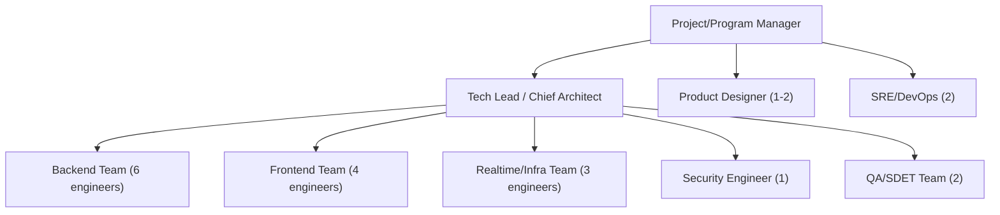

### 16.2 Responsibility Matrix (RACI, key workstreams)

| Workstream | Backend Team | Frontend Team | Realtime/Infra | Security | QA | SRE |
|---|---|---|---|---|---|---|
| MTP-lite protocol | R | C | A | C | I | I |
| Messaging/Chat services | A/R | C | I | C | R | I |
| Web client UI | I | A/R | I | I | R | I |
| Media pipeline | R | C | A | C | R | C |
| Calls (signaling + SFU) | C | R | A/R | C | R | C |
| Secret Chats / E2E | C | R | I | A/R | R | I |
| Infra/K8s/CI-CD | I | I | C | C | I | A/R |
| Observability | C | I | R | I | I | A/R |
| Load testing | C | I | R | I | A/R | R |
| Security review/pen test | C | C | C | A/R | R | C |

*(R = Responsible, A = Accountable, C = Consulted, I = Informed)*

---

## 17. Risk Register

| # | Risk | Likelihood | Impact | Mitigation |
|---|---|---|---|---|
| R1 | Custom binary protocol has undiscovered edge-case bugs affecting message ordering | Medium | High | Extensive property-based testing, staged rollout, protocol versioning for hot-fixes |
| R2 | Scylla/Cassandra partitioning strategy doesn't scale for very large groups (200k members) | Medium | High | Early load-test spike in Phase 2; fan-out-on-write vs fan-out-on-read hybrid design |
| R3 | Vanilla JS frontend velocity slower than framework-based alternative | Medium | Medium | Invest early in reusable Web Component library; strict component contracts |
| R4 | SFU selection/build for group calls underestimated in complexity | High | High | Time-boxed spike in Phase 6 before committing; fallback to mesh P2P for small groups (≤4) |
| R5 | E2E encryption implementation flaw compromises Secret Chat confidentiality | Low | Critical | External cryptography review before launch, use vetted primitives (`ring`, Web Crypto), no custom crypto primitives |
| R6 | Regulatory/compliance requirements (GDPR, data residency) emerge late | Medium | Medium | Legal review kickoff in Phase 0, build export/delete APIs by design from Phase 3 |
| R7 | Push notification delivery reliability (APNs/FCM quota/config issues) | Medium | Medium | Early integration testing, monitoring, retry/backoff queues |
| R8 | Team ramp-up time on Rust async ecosystem | Medium | Medium | Internal Rust training track in Phase 0, pair programming, code review standards |
| R9 | Media transcoding costs/latency at scale | Medium | Medium | Benchmark early, consider hardware-accelerated transcoding, tiered quality |
| R10 | Scope creep toward full Telegram Premium feature set | High | Medium | Strict phase gating, change-control process via PM/Tech Lead sign-off |

---

## 18. Non-Functional Requirements & Capacity Planning

### 18.1 Target Scale (Launch + Year 1)

| Metric | Launch Target | Year-1 Target |
|---|---|---|
| Monthly Active Users (MAU) | 500,000 | 10,000,000 |
| Peak concurrent WS connections | 50,000 | 250,000 |
| Messages/sec (peak) | 2,000 | 25,000 |
| Media uploads/day | 200,000 | 5,000,000 |
| p95 message delivery latency (intra-region) | < 200ms | < 150ms |
| Storage growth (messages) | ~1.5 TB/month | ~25 TB/month |

### 18.2 Capacity Model (per gateway node, indicative)

| Resource | Per-Node Budget | Notes |
|---|---|---|
| WS connections per gateway pod | ~10,000 | Tokio task per connection, ~40KB overhead each |
| CPU per 10k connections | ~2 vCPU | Mostly idle keep-alive, spikes on encode/decode |
| Memory per 10k connections | ~1.5 GB | Buffers + session state |
| Horizontal scaling trigger | CPU > 65% or conn count > 8,500 | HPA policy |

### 18.3 Availability Targets

| Component | Target Uptime |
|---|---|
| Gateway/Messaging path | 99.95% |
| Media pipeline | 99.9% |
| Search | 99.5% (best-effort, non-critical path) |
| Calls signaling | 99.9% |

---

## 19. Glossary

| Term | Definition |
|---|---|
| MTP-lite | Mesera Transport Protocol — the custom binary WS protocol described in §7 |
| Bounded Context | DDD term for a self-contained domain module with its own model and language |
| SFU | Selective Forwarding Unit — media server topology for group video calls |
| Fanout | Process of distributing one event to many subscriber devices/queues |
| Secret Chat | E2E-encrypted chat mode where the server only relays ciphertext |
| WBS | Work Breakdown Structure |
| HPA | Horizontal Pod Autoscaler (Kubernetes) |
| LWT | Lightweight Transaction (Cassandra/Scylla conditional write) |

---

## 20. Appendices

### 20.1 Reference ADR Index (to be authored in Phase 0)

| ADR | Title |
|---|---|
| ADR-001 | Choice of event log: Kafka vs NATS JetStream |
| ADR-002 | Message store: ScyllaDB vs Cassandra vs sharded Postgres |
| ADR-003 | MTP-lite vs adopting an existing protocol (e.g., raw gRPC-Web) |
| ADR-004 | Frontend: vanilla JS + Web Components vs lightweight framework |
| ADR-005 | SFU: build vs adopt (mediasoup/Janus) vs `webrtc-rs`-based custom |
| ADR-006 | Auth token strategy: JWT vs opaque server-side session tokens |
| ADR-007 | Sharding strategy for PostgreSQL at scale |
| ADR-008 | Push provider abstraction design |
| ADR-009 | Search engine: OpenSearch vs Meilisearch |
| ADR-010 | Secrets management: Vault topology |

### 20.2 Coding Standards Summary

- Rust: `rustfmt` + `clippy::pedantic` (selected lints), no `unsafe` outside audited FFI boundaries, all public APIs documented with `///` doc comments, errors modeled via `thiserror`, no `.unwrap()`/`.expect()` in service request paths (only in `main`/init code).
- JavaScript: ESLint with strict ruleset (`eslint:recommended` + custom rules), JSDoc type annotations for public module APIs, no global namespace pollution, all Web Components registered with `mesera-` prefix.
- Git workflow: trunk-based development with short-lived feature branches, mandatory PR review (2 approvals for core crates), squash-merge, Conventional Commits for changelog automation.

### 20.3 Environment Matrix

| Environment | Purpose | Data | Access |
|---|---|---|---|
| Local (docker-compose) | Individual dev loop | Synthetic/fixture data | All engineers |
| CI (ephemeral) | Automated test runs | Fixture data, recreated per run | CI system only |
| Staging | Integration/E2E/load testing | Anonymized/synthetic data | Engineering team |
| Production | Live service | Real user data | Restricted, audited access via Vault-issued short-lived credentials |

---

*End of document.*
